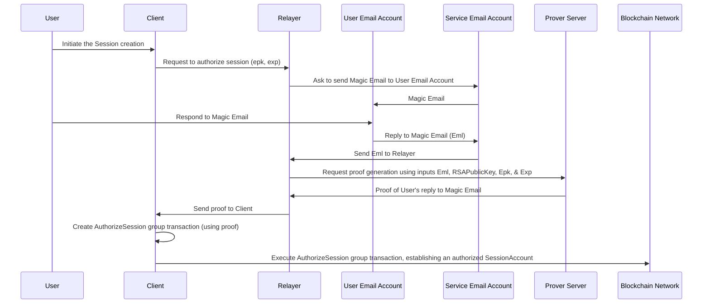

# Zorkin: Magic Link Web3 Successor - Magic Email

<p align="center">
  
</p>

Functions just like a [Magic Link](https://auth0.com/docs/authenticate/passwordless/authentication-methods/email-magic-link) for authentication; instead of typing in a code, you just reply to the email if you accept the request to initiate a session for the specified duration. The initiated session gives you access to a self-custodial blockchain account, with exclusive access given to the authenticated user through the ephemeral private key, which is a session parameter that stays within the application client. We refer to this self-custodial wallet access method as *Magic Email*.

## Domain Keys Identified Mail (DKIM)

[Domain Keys Identified Mail (DKIM)](https://www.cloudflare.com/en-au/learning/dns/dns-records/dns-dkim-record/) protocol is used to prevent spoofing of emails, by including an email signature in the header of the email. The signature is generated using a private key known only by the email provider, and can be verified using the public key that is published in the DNS records of the email provider at the same domain. This signature is included in email files, and can be verified by the recipient's email provider. We refer to these email files as `Eml`s.

The actual signature is the following:
```
RSASign(Sha256(from:<>, to:<>, subject:<>, body:<>, ...), DKIMRSAPrivateKey)
```

Email providers periodically refresh these keys, so they can't be hardcoded into an immutable smart contract variable. We assume we have a cache of these keys available for on-chain DKIM signature authenticity verification, which are periodically updated by performing decentralized DNS record retrievals using a Multi-Party Computation (MPC) solution like [ChainLink](https://chain.link).

## Magic Email

In the website client that interfaces with Magic Email, an ephemeral ED25519 key is generated with a private key component (`esk`) and public key component (`epk`), along with an expiration specified in terms of validity rounds (`exp`) once a user inputs their email address (`userEmailAddress`) to start a Magic Email session. The public key and its expiration are inserted into a request to initiate a session to a backend server, which will send the user an email to `userEmailAddress` where it specifies the `epk` and `exp` in a structured format inside the body of the sent Email, using an email sending service such as [Resend](https://resend.com).

The user is then instructed to visit their email account, where they will receive a Magic Email session request from an official domain that was sent by the mailing service. We assume the sender of this email is officially the email address `serviceEmailAddress`, representing the email address through which session requests are sent. The email describes what to do next, and that it will give the user access to a self-custodial wallet specifically for the website for the specified duration. If the user agrees to the terms, they are instructed to simply reply to the email. We will assume they've replied to the email.

The backend will receive the users response email (`Eml`), which will then send it to the `prover`. The `prover` is apart of a [ZK-SNARK](https://www.youtube.com/watch?v=gcKCW7CNu_M) GROTH16 proving system derived from a circuit denoted `emailCircuit`. `emailCircuit` takes the `Eml`, `RSAPublicKey`, and `serviceEmailAddress` as private inputs, and a public input `publicInput` that's the hash of the session parameters `epk` & `exp`, along with values `RSAPublicKey` and `serviceEmailAddress`. The `RSAPublicKey` is the public key that's recorded in the DNS records of the email domain of the `userEmailAddress`, following the `DKIM` protocol. The `emailCircuit` will validate that `Eml` is not spoofed through verification of the DKIM signature, and then proceed to prove that the `epk` & `exp` are in the body, and that it is a response from the user with email address `userEmailAddress` to the session authorizing email they were sent from `serviceEmailAddress`. [ZK-Email](https://prove.email/) have made this process easy through their open-source and MIT licensed SDKs, where they have developed innovations like ZK-Regex to perform regex efficiently in a circuit using a Deterministic Finite Automata (DFA) approach to make ZK operations on email efficient and easy.

Once the `prover` has generated the `proof`, it will be relayed to the frontend client. When ready, the client will package this `proof` along with the `publicInput` and the pre-image to the hash, `RSAPublicKey`, `epk`, `exp`, & `serviceEmailAddress` into the following group transaction:

1. `TenantAuth`: An application call to the function `ApproveSession` of the TenantAuth application with Id `TenantAuthAppId`. The `TenantAuth` application is responsible for asserting that the authorization is valid, with information in each component transaction shared through the note field. 
2. `RSAVerifier`: An application call to the function `VerifyRSAPublicKey` with the `RSAPublicKey` and the Poseidon hash of the domain of `userEmailAddress` as arguments.
3. `ProofVerifier`: A self-payment of 0 to a [Logic Signature contract account](https://developer.algorand.org/docs/get-details/dapps/smart-contracts/smartsigs/modes/#contract-account) with address `proofVerifierAddr` that will perform verification of the proof, being a verifier generated by compilation of the `emailCircuit`. The argument is the `proof`, and the note is the `publicInput`.
4. `SessionAccount`: A self-payment of 0 to a Logic Signature contract account, with a note containing the publicInput pre-image `RSAPublicKey`, `epk`, `exp` and `serviceEmailAddress`. The SessionAccount represents the users self-custodial account, and contains their assets along with approval logic to authorize sessions and authenticate a user within a session.

Successful approval of the transaction means the user identified by their email address `userEmailAddress` approved a session where they can transact from the `SessionAccount` by providing the authorizing `SessionAccount` logic signature an argument of a signature of the transaction Id signed with the ephemeral private key where its public key is recorded as a template variable in the logic signature; provided the last validity of the transaction is before the recorded expiration of the ephemeral key that's specified as another template variable. We describe these components in the following subsection.


## Components of the Solution


### Email Circuit

`emailCircuit` is a ZK-SNARK circuit that takes the private inputs: (1) the users email reply `Eml` to the Magic Email they were sent, (2) the public key of the RSA key that the users email provider used to sign the `Eml` following the DKIM scheme, and (3) the ephemeral public key `epk` and its validity round expiration `exp`. The circuit also takes a public input as the [MIMC](https://eprint.iacr.org/2016/492.pdf) hash of the ephemeral public key `epk` and expiration `exp`, `RSAPublicKey`, `serviceEmailAddress` that sent the Magic Email, the `userEmailAddress` that replied to the email to approve of the session and its domain `userEmailDomain`. These inputs are related through equality constraints of the form `A*B+C==0` with the assistance of pre-processed inputs that are stored into what's known as the `Witness` and supplied during proof generation. The `epk` and `exp` are asserted to be present in the body of the email. We compare the users email address in the email against a [Poseidon hash](https://eprint.iacr.org/2019/458.pdf) of their email address provided in the public input to preserve the users privacy, with the Poseidon hash representing a unique identifier of a user in terms of their email address (`userEmailAddressHash`).

For simplicity's sake, we will assume `serviceEmailAddress` only sends emails to establish session requests. Meaning a reply to one of its sent emails must be a user that's approving a request, particularly once the DKIM signature has been verified.

```java
MagicEmailCircuit(private Eml, private RSAPublicKey, private epk, private exp, public publicInput):
  // Assert the users email reply wasn't spoofed via RSA verification following the DKIM protocol
  assert RSAVerify(Eml, RSAPublicKey)

  // Extract components of interest from the Eml
  serviceEmailAddress = Eml.receiver;
  userEmailAddress = Eml.sender;
  userEmailAddressHash = Poseidon(userEmailAddress);
  body = Eml.body;
  userEmailDomainHash = Poseidon(Eml.senderDomain);

  // Assert epk and exp are in the body of the email, in the expected places.
  // This is trivial using ZK-Regex, which uses a DFA approach to perform regex in a circuit.
  assert body.containsEphemeralPublicKeyInExpectedPlace(epk);
  assert body.containsEphemeralPublicKeyExpirationInExpectedPlace(exp);
  
  // Create the expected public input from the pre-image parameters. We will assume MIMC7 hash is used.
  assert publicInput == MIMCHash(epk, exp, RSAPublicKey, serviceEmailAddress, userEmailAddressHash, userEmailDomainHash);
```

Assume this compiles to a GROTH16 proving system based on the [BN254](https://neuromancer.sk/std/bn/bn254/) curve, consisting of the `prover` and verifier denoted `ProofVerifier`. Denote the verification key parameters of the `ProofVerifier` as `EMLVKey`.


### ProofVerifier

The following is an on-chain verifier of proofs generated by the `prover`, and is implemented as a Logic Signature (LSIG) contract account with the `EmlVKey` verification parameters hardcoded. Recall that the address of the LSIG is the hash of its program code, meaning by asserting the address is `proofVerifierAddr` we are asserting it is the verifier we expect with the corresponding VKey.

```python
# Define the verification key parameters of the ProofVerifier
VKey = EmlVKey

def ProofVerifier(proof):
    # Assert fees are covered externally through fee-pooling
    assert Txn.fee() == 0
    publicInput = Txn.note()
    assert ProofIsValid(proof, publicInput, VKey)
```

### RSAVerifier

```python
BoxStorage validRSAPublicKeysByDomain
string MPCHTTPSClientAddress
string MPCHTTPSClientChain

# Assert whether the specified RSA public key is officially used by the specified email provider
def ValidateEmailRSAPublicKey(RSAPublicKey, userEmailDomainHash):
  assert validRSAPublicKeysByDomain[userEmailDomainHash].has(RSAPublicKey)

def UpdateEmailRSAKeyCache(VAAMessage):
  assert Wormhole.Core.MessageIsValid(VAAMessage)
  # Check if the sender and source chain match the expected MPC HTTPS client and chain
  assert VAAMessage.sender == MPCHTTPSClientAddress
  assert VAAMessage.source_chain == MPCHTTPSClientChain
  # Update cache of valid email domain RSA public keys. Assume MPC performs DNS lookups via HTTPS.
  dnsRecordPublicKeys = VAAMessage.dnsRecordPublicKeys
  domainHash = VAAMessage.domainHash
  validRSAPublicKeysByDomain[domainHash] = dnsRecordPublicKeys
```

### TenantAuth

`TenantAuth` is an application that is used to orchestrate proof verification to authorize the [rekeying](https://developer.algorand.org/docs/get-details/accounts/rekey/) of the SessionAccount to a new SessionAccount with template variables for the ephemeral public key `epk` and its expiration `exp`. Effectively establishing a time-bound session, where the user can transact using `esk` until the transactions has a last validity that exceeds the bounded `exp`. The TenantAuth maintains a list of service email addresses it considers valid, through which it sends magic emails. This does not affect the self-custody property, as a user still has the option to not reply, and as we'll show later email spoofing is not possible when signatures are authenticated against the `RSAVerifier` application. 

```python
BoxStorage ValidSerivceEmailAddresses
string RSAVerifierAppId

def AddNewValidEmailAddress(validServiceEmailAddress):
  assert Txn.sender == AppParam.creator()
  validServiceEmailAddresses.add(validServiceEmailAddress)

def ApproveSession():
  assert Txn.group_size == 4
  baseSessionAccountTxn = Gtxn[3]
  epk, exp, RSAPublicKey, serviceEmailAddress, userEmailAddressHash, userEmailDomainHash = baseSessionAccountTxn.note()

  # Assert the proof is for the Magic Email reply to a valid service email address
  assert ValidSerivceEmailAddresses.has(serviceEmailAddress)

  # Assert the proof is valid
  PublicInput = MIMCHash(epk, exp, RSAPublicKey, serviceEmailAddress, userEmailAddressHash, userEmailDomainHash)
  proofVerifierTxn = Gtxn[1]
  assert proofVerifierTxn.sender == ProofVerifierAddr
  assert proofVerifierTxn.note() == PublicInput

  # Assert DKIM RSA Key is Authentic
  RSAVerifierTxn = Gtxn[2]
  assert RSAVerifierTxn.appId == RSAVerifierAppId
  assert RSAVerifierTxn.application_args[0] == "ValidateEmailRSAPublicKey"
  assert RSAVerifierTxn.application_args[1] == RSAPublicKey
  assert RSAVerifierTxn.application_args[2] == userEmailDomainHash

def RevokeSession():
  # Allow a Tenant (creator of this application) to revoke any active session
  # through rekeying back to the base SessionAccount
  assert Txn.sender == AppParam.creator()
  assert Txn.group_size == 2
  assert Gtxn[1].type == "rekey"
  assert Gtxn[1].rekeyTo == Gtxn[1].sender
```

### SessionAccount

```python
# Define constants and templates.
DefaultEphemeralKey = Bytes(16, "CAFEFACE")
ExpTemplate = TMPL('TMPL_EXP')
EpkTemplate = TMPL('TMPL_EPK')
userEmailAddressHash = TMPL('TMPL_USEREMAILADDRESSHASH')
TenantAuthAppId = TMPL('TMPL_TENANTAUTHAPPID')

def tenantIsRevokingSession():
    # Only the assigned Tenant can revoke any active session
    assert Txn.groupSize == 2
    assert Gtxn[0].type == "appl"
    assert Gtxn[0].appId == TenantAuthAppId
    assert Gtxn[0].appArgs[0] == "RevokeSession"
    # Assert it's just a rekey to the base SessionAccount
    assert Txn.type == "rekey"
    assert Txn.rekeyTo == Txn.sender
    # The fee should be covered by the Tenant to prevent fee draining attacks
    assert Txn.fee() == 0

def provenMagicEmailReplyToAuthorizeSession():
    # ApproveSession will orchestrate proof and RSA verification to authorize the session
    assert Gtxn[0].type == "appl"
    assert Gtxn[0].appId == TenantAuthAppId
    assert Gtxn[0].appArgs[0] == "ApproveSession"
    # Assert the ephemeral private key component to epk in the authorization has signed this
    # transaction Id, to prevent replay of the proof
    [epk] = Txn.note()
    assert ED25519Verify(Txn.txID, epk, Txn.sig)

# Entry point for LSIG (Logic Signature) execution.
def SessionAccount(sig):
    # Case: Revocation of any active session to the base account
    if Gtxn[0].appId == TenantAuthAppId:
        # Assert the creator is only attempting to revoke any active session
        assert tenantIsRevokingSession()

    # Case: Base state, representing first session creation
    elif EpkTemplate == DefaultEphemeralKey:
        assert Txn.fee() == 0
        assert provenMagicEmailReplyToAuthorizeSession() 

    # Case: Using an active session (Session usage).
    elif (ED25519_Verify(sig, Txn.transaction_id, EpkTemplate) and
          ExpTemplate < Txn.last_valid_round): 
        Approve()

    # Case: Rekeying to a new SessionAccount to authorize a new session.
    else:
        assert Txn.fee() == 0
        assert provenMagicEmailReplyToAuthorizeSession()
```

### Reproduction of a SessionAccount

Since a SessionAccount is a Logic Signature, we need a way to reproduce its program code using the appropriate template variables. We explain how in the following, which shows how to reproduce both a base SessionAccount and its authorizing SessionAccount using an Indexer of blockchain state, `TenantAuthAppId` and the input `userEmailAddressHash`.

```python
defaultEphemeralKey = Bytes(16, "CAFEFACE")
def GetBaseAccount(
    userEmailAddressHash,
    TenantAuthAppId
  ):
  return SessionAccount({
    TMPL_USEREMAILADDRESSHASH: userEmailAddressHash,
    TMPL_EPK: defaultEphemeralKey, TMPL_EXP: 0,
    TMPL_TENANTAUTHAPPID: TenantAuthAppId
    })

def GetAuthorizingAccount(
    userEmailAddressHash,
    TenantAuthAppId
  ):
  # Get the last transaction of the authorizing address
  baseAccount = GetBaseAccount(userEmailAddressHash, TenantAuthAppId)
  authorizingAddress = baseAccount['auth-addr']
  lastAuthTxn = Indexer.GetLastTxn(authorizingAddress)
  if lastAuthTxn == None:
    return GetBaseAccount(userEmailAddressHash, TenantAuthAppId)
  # Get the template variables from the last transaction
  epk, exp, tenantAuthAppId = ReadTemplateVariables(lastAuthTxn)
  return SessionAccount({
    TMPL_USEREMAILADDRESSHASH: userEmailAddressHash,
    TMPL_EPK: epk, TMPL_EXP: exp,
    TMPL_TENANTAUTHAPPID: tenantAuthAppId
    })

def GetSessionAccount(
    userEmailAddressHash,
    TenantAuthAppId
  ):
  return [
          GetBaseAccount(userEmailAddressHash, TenantAuthAppId),
          GetAuthorizingAccount(userEmailAddressHash, TenantAuthAppId),
        ]

def GetNewAuthorizingSessionAccount(
      userEmailAddressHash,
      TenantAuthAppId,
      epk,
      exp
    ):
    return SessionAccount({
      TMPL_USEREMAILADDRESSHASH: userEmailAddressHash,
      TMPL_EPK: epk, TMPL_EXP: exp,
      TMPL_TENANTAUTHAPPID: tenantAuthAppId
      })
```

## Procedures and Protocols

We define the procedures and protocols that involve the components of the solution described above, covering the following:
- Session Authorization
- Revocation of a Session
- Updating the RSA Public Key Cache
- Migrating to a new service email address

### Sequence Diagram



### Session Authorization

The following is the procedure for a user to authorize a session, where the user is sent a magic email specifying the session parameters: an ephemeral public key (`epk`) and its validitity expiration (`exp`). By replying to the email from their email account with address `userEmailAddress` they generate a proof that they sent the reply, where we can prevent email spoofing through the DKIM scheme. This proof can be used in conjunction with a signature from the corresponding ephemeral private key (`esk`) which never leaves the users client of a transaction Id to authorize a rekey of the users `SessionAccount` uniquely identified by `userEmailAddressHash` to a new authorizing time-bound `SessionAccount` that specifies the `epk` and `exp` as template variables. The authorizing `SessionAccount` will allow the holder of `esk`, the user, to freely transact from the account providing signatures of the transaction Ids. Transaction Ids are made unique and mutually exclusive during their validity time range through the use of a randomly generated `lease` value.


The procedure for this protocol is as follows:
1. The user inputs their email address `userEmailAddress` into the website client to start a Magic Email session. This email address is hashed into the user identifier `userEmailAddressHash` using the ZK-SNARK friendly Poseidon hash function.
2. The client generates the ephemeral key pair (`epk`, `esk`) with a validity expiration `exp`.
3. The client sends a request to the `relayer` to initiate session creation, the `relayer` sends the user an email from the `serviceEmailAddress` to `userEmailAddress` in a specific format that includes the `epk` and `exp` in the body of the email.
4. The user is instructed to check their email account. To approve the session, they simply reply to the email. The reply can be blank.
6. The `relayer` receives this email reply (`Eml`), where it then relays it to the `prover` to generate a `proof`. The `prover` and verifier of proofs, the `ProofVerifier`, are generated by compilation of the `emailCircuit` described above. The relayer also provides `MIMCHash(epk, exp, RSAPublicKey, serviceEmailAddress, userEmailAddressHash, userEmailDomain)` as the public input (`publicInput`), and `Eml`, `RSAPublicKey`, `epk`, `exp`, and `userEmailDomain` as private inputs. Note that `MIMCHash` is a particular variant of the [MIMC](https://eprint.iacr.org/2016/492.pdf) one-way hashing function, `RSAPublicKey` is the public key of the RSA key that the users email provider used to sign the email header with following the DKIM scheme. `RSAPublicKey` is retrieved from the DNS records of the domain of the users email address (`userEmailDomain`). The `prover` itself is hosted in a server called the `prover-server`.
7. The `relayer` relays the `proof` it received back to the client, along with the `publicInput`.
8. The users `SessionAccount` and its authorizing `SessionAccount` are reproduced by calling `GetSessionAccount(userEmailAddressHash, TenantAuthAppId)`, using the procedure defined above for the reproduction of a `SessionAccount`. `TenantAuthAppId` is the Id of the `TenantAuth` application, corresponding to the Magic Email client.
9. The client constructs the following group transaction, using the data gathered so far:
   - **TenantAuth**: An application call to `TenantAuth` with application Id `TenantAuthAppId`, corresponding to the Magic Email client, to the `ApproveSession` function.
   - **RSAVerifier**: An application call to `RSAVerifier` with the application Id `RSAVerifierAppId` to the `ValidateEmailRSAPublicKey`, with the arguments `RSAPublicKey` and `userEmailDomain`.
   - **ProofVerifier**: A self-payment of 0 to the Logic Signature account `ProofVerifier`, with address `proofVerifierAddr`. A note is added with the `publicInput`.
   - **SessionAccount**: A self-payment of 0 to the base `SessionAccount`, signed with the authorizing `SessionAccount` which is provided a signature made with `esk` of the transaction Id as an argument. A note is added, containing the `publicInput` pre-image `epk`, `exp`, `RSAPublicKey`, `serviceEmailAddress`, `userEmailAddressHash`, and `userEmailDomain` as a concatenated byte array that's readily extracted on-chain. To prevent replay attacks, the `lease` is set to a random value which will ensure the transaction Id is random and that the transaction is mutually exclusive until its validity expiration.
10. The transaction is submitted to the blockchain network for evaluation.

The atomic nature of a group transaction allows us to split up the authentication protocol into specialized transactions, for example one to assert proof validity. It's not possible to have them combined into a single transaction, as their are limitations that constrain us from doing so: for example, the `SessionAccount` must be a stateless LSIG so the user can transact using it like a standard wallet. Approval of the transaction, in light of the components defined previously, will mean that only the user identified by their email address hash, `userEmailAddressHash`, having access to their email account, has approved of the creation of a session. They're now able to spend from the SessionAccount using only the ephemeral key, whose private key is known only to the client (self-custodial), until the session expiration `exp` (i.e. when the last validity of a transaction exceeds this value).

### Transacting within a Session

Once in an authorizing session, the client can reproduce their session account and spend by signing the transaction Id with their ephemeral private key, `esk`, and providing that as an argument to the authorizing `SessionAccount` logic signature that signs the transaction. The user who has authorized the session is assumed to have done so using their email address, `userEmailAddress`, with Poseidon hash `userEmailAddressHash`. In steps:

1. The users `SessionAccount` and its authorizing `SessionAccount` are reproduced by calling `GetSessionAccount(userEmailAddressHash, TenantAuthAppId)`, using the procedure defined above for the reproduction of a `SessionAccount`. `TenantAuthAppId` is the appId of the `TenantAuth`, corresponding to the Magic Email client.
2. Construct the transaction, sent from the `SessionAccount` with Id `TxId`. Add a random lease value, to prevent replay as explained previously.
3. Sign `TxId` with `esk` to produce signature `sig`
4. Sign the transaction using the authorizing `SessionAccount`, with `sig` provided as an argument.
5. Submit the transaction to the network.

### Revocation of a Session

A tenant can revoke an active session, for example as a safety precaution or to take back control from an adversary. To do so, they simply construct the following group transaction. A tenant is a user of the Magic Email service, where they wish to provide a self-custodial, domain specific, wallet solution for their users allowing low-friction access through the Magic Email described above. The `SessionAccount` is reproduced by calling `GetSessionAccount(userEmailAddressHash, TenantAuthAppId)`, with the `userEmailAddressHash` being the Poseidon hash of the email address of the user whose session is to be revoked.

1. **TenantAuth**: Application call to the `TenantAuth` application with Id `TenantAuthAppId`, to the function named `RevokeSession`. `TenantAuthAppId` is the application Id for the `TenantAuth` application belonging to the tenant.
2. **SessionAccount**: A self-payment of 0 to the users `SessionAccount`, signed with the authorizing `SessionAccount`.

Review the components above to see how the atomic transaction will ultimately result in session revocation. Users still retain custody of their assets in the presence of the revocation feature, because it only allows rekey back to the base `SessionAccount` which only the user can access.

### Updating the RSA Public Key Cache

We must maintain a cache of RSA public keys for each supported email provider, such as *Gmail*. This is to account for how DKIM RSA public keys are regularly rolled over, and must be checked against to ensure that the email isn't spoofed through signing with an unauthentic DKIM RSA key. To achieve this, we rely on a multi-party computation (MPC) solution to perform decentralized DNS Record lookups through DNS over HTTPS using an API such as [Cloudflare DNS over HTTPs](https://developers.cloudflare.com/1.1.1.1/encryption/dns-over-https/make-api-requests/). A good MPC provider is [ChainLink](https://chain.link/). The MPC results are communicated to the blockchain Magic Email is built on through [Wormhole Bridging](https://docs.wormhole.com/wormhole/quick-start/cross-chain-dev/). Since MPC requests are expensive, we periodically update a cache of valid RSA keys through calls to `UpdateEmailRSAKeyCache` with the [specialized relayer relayed](https://docs.wormhole.com/wormhole/quick-start/cross-chain-dev/specialized-relayer) message (`VAAMessage`), containing the result from the MPC blockchain.

As explained above, `ValidateEmailRSAPublicKey` function is included in Session authorizing group transactions so that the DKIM RSA signature can be validated against the cache.

### Migrating to a new service email address

Migration to a new service email address is straightforward. It involves simply adding the new service email address to the list of official service emails, `ValidSerivceEmailAddresses`, of the respective `TenantAuth` application by calling `AddNewValidEmailAddress` with the new service email as an argument. During session approval, the `ApproveSession` function will ensure that the Magic Email reply is replying to the official service email address that supports session creation, and not the email address of an adversary who may be attempting a phishing attack.

## Contribution Statement

Authored by Winton Nathan-Roberts of Sydney, Australia, this document details original work distinct from existing literature to the best of my knowledge. Novel contributions include application of ZK-SNARKs to allow a Zero-Knowledge equivalent of the popular Magic Link authentication method, and the mechanisms and implementations specified to realize this.
\
\
All Rights Reserved with Copyright.

## Disclaimer

This content, including texts, graphics, code, etc., is for informational purposes and provided 'as is' without guarantees.

- NO WARRANTIES: We offer no warranties or guarantees, explicit or implied.
- NO LIABILITY: We are not liable for any damages from using or inability to use this content.
- OWNERSHIP OF IMPROVEMENTS: Any feedback or ideas from the public contributing to the enhancement of this solution are exclusively owned by the author and Zorkin, assuming such ownership is legally permissible.
- NON-PATENTABILITY: The content, by virtue of being publicly available online, is not novel. Therefore any novel contributions made by the document and its trivial extensions cannot be patented, except where legal. Patent laws require novelty and non-obviousness. An exception is the author of the work has a 1-year grace period in many countries from the time of their publication to file a patent at their discretion.
- INDEPENDENCE: We do not necessarily have a direct affiliation with any party mentioned or implied besides Zorkin.
- INDEMNIFICATION: You must defend and indemnify us against all claims and damages from your use of the content.
- NOT PRODUCTION READY: The content may have vulnerabilities and is not for production use.
- USE AT YOUR OWN RISK: You are solely responsible for using the content and ensuring its legal compliance.
- UNVERIFIED CLAIMS: Claims in the content are not independently verified; do your own research before relying on them.

This disclaimer is applied to the fullest extent permitted by law. By using the content, you accept these terms. Note: I am not a legal professional. TLDR: it's an idea and an MVP, that I may or may not continue to work on at my discretion. Everything is subject to change, including the name.
