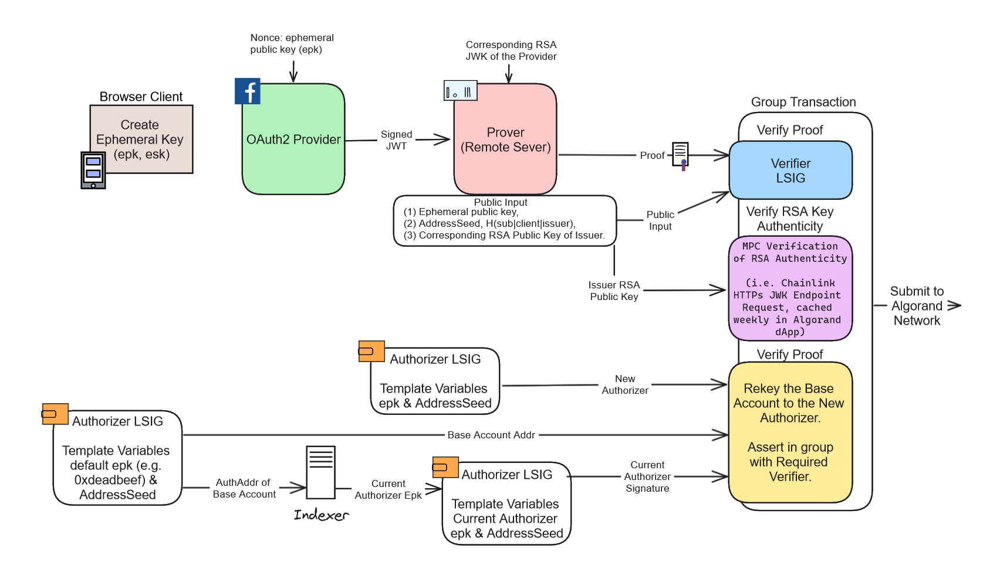
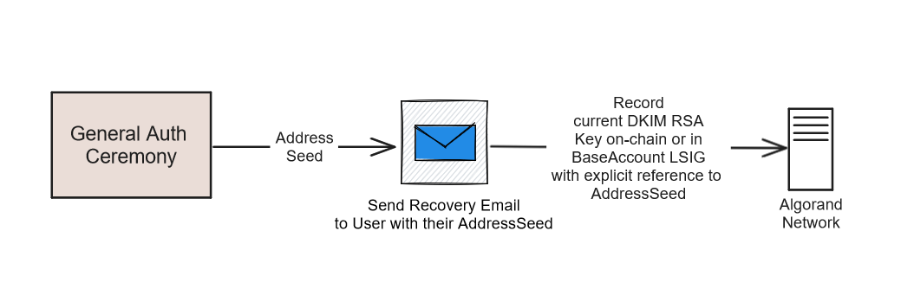
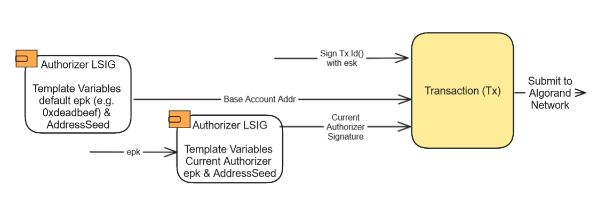
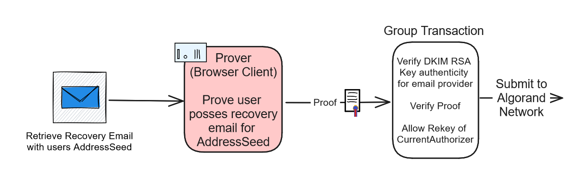

# Zorkin: ZK OAuth2 on Algorand & beyond

**Disclosure for transparency: I am currently engaged in developing ZK Login for Algorand, in whatever way makes sense, into an MVP and _potentially_ into production as quickly as possible.**

<p align="center">
  
</p>

Zorkin is trying to solve low-friction authentication to access blockchain accounts, focusing on Algorand, in a way that minimizes dependencies on external 3rd parties. It is beginning the endeavour with initial focus on using OAuth2 as an access point, maintaining privacy through ZK-SNARKs. Each major section proposes a solution for a feature or service that moves Zorkin closer to that goal. Zorkin will likely evolve over time, including its goals and naming. There are no warranties, and there is a chance it will never see use by the public if it proves to be technically or economically infeasible. For now, it is expressed in terms of a proposal and in most cases a corresponding MVP demo. Features explained aren't necessarily implemented yet, and some of them may be conceptual and forwards looking but with no guarantee of realisation. Zorkin is not affiliated in anyway with any other 3rd party entity like Sui.

# Native ZK-SNARK OAuth2 with ZKEmail Account Recovery

Access to a blockchain account can be granted through an account accessed via OpenID Connect, enabling users to log in to a decentralized application (dApp) using their preferred big-tech OAuth2 provider, such as Google or Facebook. By utilizing Zero-Knowledge Succinct Non-Interactive Argument of Knowledge (ZK-SNARKs) and well-designed smart contracts, as detailed below, it is possible to maintain the security of the sensitive JSON Web Token (JWT) off-chain. This process allows for the issuance of an ephemeral key with which funds can be transacted, ensuring that the sensitive private key never leaves the client's browser. Additionally, should users lose access to their account, they can recover it while preserving decentralization through ZK-Email. This service verifies information about an email account without exposing private data. The system's infrastructure eliminates the need for any third-party backend or database, with the exception of the optional prover, which can be outsourced to a third-party provider if desired.


## Method

In the subsequent subsections, we will examine and clarify four key aspects: authentication in common scenarios, the process of creating an initial account, how to sign a transaction once authenticated, and the procedure for account recovery.

### LSIG Account Components

These components are relevant to the following explanation, so they are being defined first for later reference.

**JWT Proof Verifier (JWTVerifier) (LSIG)**
```python
VKey = "..." # Harcoded VKey parameters
MPCRSAVerifierAppId = "..." # Harcoded AppId of the MPC RSA Verifier
def verifyJWTProof(epk, AddressSeed, RSA_pk, proof):
  # Perform on-chain ZK-SNARK proof verification (e.g. GROTH16)
  assert ProofIsValid(VKey, proof, epk, AddressSeed, RSA_pk)
  # Check it is in the expected group
  assert Global.groupSize == 3
  assert Txn.groupIndex == 0
  assert Gtxn[2].note == AddressSeed
  assert Gtxn[1].appId == MPCRSAVerifierAppId
  assert Gtxn[1].appArgs[0] == RSA_pk
```
\
**MPC RSA Key Authenticity Verifier (MPCRSAVerifier) (Stateful App)**
```python
# Assert whether given RSA_pk is authentic
def MPCVerifyRSAKey(RSA_pk):
  assert IsRSAStoredInCache(RSA_pk)
# Update the cache with the latest authentic RSA public key as retrieved
# from the official endpoint by MPC HTTPs request (Chainlink), communicated by Wormhole.
def UpdateCache(VAAMessage):
  assert Wormhole.Core.MessageIsValid(VAAMessage)
  UpdateRSACache(VAAMessage.payload.newRSAPk)
```
\
**Authorizer Gateway (AuthorizingLSIG) (LSIG)**
```python
AddressSeed = TMPL('TMPL_ADDRSEED')
EphemeralPK = TMPL('TMPL_EPK')
VerifierAddr = "..." # Harcoded Address of the verifier LSIG
MPCRSAVerifierAppId = "..." # Harcoded AppId of the MPC RSA Verifier
defaultEphemeralKey = "DEADBEEF" # Harcoded default ephemeral public key (base case)
def ZKVerifyOAuth2JWT():
    assert Txn.note == AddressSeed
    assert Txn.type == "rekey"
    assert Global.groupSize == 3
    assert Txn.groupIndex == 2
    assert Gtxn[0].sender == VerifierAddr
    assert Gtxn[1].appId == MPCRSAVerifierAppId
    assert Gtxn[1].appArgs[0] == RSA_pk
    # ... and other relevant assertions to ensure it's grouped with a relevant Verifier

def ZorkinAuthorizingLSIG(epk, sig):
    addressBinding = len(AddressSeed) == 32
    epkBinding = len(EphemeralPK) == 32
    bindingValid = addressBinding and epkBinding
    assert bindingValid

    txSigIsValid = ED25519_Verify(sig, Txn.id, EphemeralPK)  

    if (EphemeralPK == defaultEphemeralKey or !txSigIsValid):
        return ZKVerifyOAuth2JWT()

    return txSigIsValid
```

### General Authentication (Recursive Case)

To begin the general authentication ceremony, an ephemeral keypair (`epk`, `esk`) is generated client-side. It is specified as the nonce in the OpenIDConnect OAuth2 authentication request, where the chosen OAuth2 provider signs an issued JWT containing the nonce with an RSA key with public key component `RSApk` that's specified at their JWK endpoint. The JWT is then provided to a prover, to generate a proof of a ZK program circuit that has the JWT as private input, and `RSApk`, `AddressSeed` (Poseidon hash of the sub, client and issuer fields of the JWT) and the `epk` as public inputs. The proof proves that the specified RSA key signed the JWT, and that the JWT payload specifies claims of that match that can derive the AddressSeed in the public input, and that the nonce of the JWT specifies the `epk`. 
\
\
Now we reproduce the base account containing the users assets. This is trivial, since base account is the above Authorizer LSIG with `TMPL_EPK` set to `0xDEADBEEF` and `TMPL_ADDRSEED` to `AddressSeed`, which we refer to as the `BaseLSIG`. Next we reproduce the Authorizer LSIG that is set as the `auth-addr` (Authorizing Address) of the account denoted `AuthorizingLSIG`, by using the indexer to search for the last transaction it issued where the ephemeral key used must be specified (read from the LSIG or its arguments) allowing us to reproduce the LSIG by filling in its respective template variables. 
\
\
A group transaction is composed of three linked elements: a transaction to an LSIG with the `JWTVerifier` for proof validation, an application call to `MPCRSAVerifier` to confirm the authenticity of an RSA key for the issuer, and a rekeying transaction changing the `BaseLSIG` to a new Authorizing LSIG with the `epk`. The `AuthorizingLSIG` signs the rekeying transaction and will approve it if it's part of the group transaction and the unique verifier address, defined by its Verification Key parameters, matches. The RSA key verifier maintains a cache, sourced from the issuer's JWK endpoint via decentralized computation (like *Chainlink*), updated periodically (e.g., weekly) to minimize gas fees.
\
If any part of the group transaction fails, the entire transaction is invalidated. However, a successful group transaction means the ephemeral key has been authorized, as it's confirmed that the user could access the OAuth2 provider account, uniquely associated with the Address Seed, without revealing the sensitive JWT on-chain, thanks to ZK-SNARKs.
\
The new Authorizing LSIG gets spending authority from the `BaseLSIG` upon validating a signature argument of an ongoing transaction from the `BaseAccount`. Integral to the process, the Verifier LSIG checks that the rekey transaction to the `AuthorizingLSIG` cites the AddressSeed, matching the public proof input to ensure only valid proofs can rekey `BaseAccounts` with the same AddressSeed. Additionally, it confirms the presence of `MPCRSAVerifier` within the group, tasked with verifying the RSA public key's authenticity, as presented in the public input of the proof.
\
\
The following section addresses the unique scenario of initial account creation, where the `BaseLSIG` doesn't meet the 0.1A Minimum Balance Requirement and initially has no secure authorizing LSIG. Despite these conditions, security is maintained, as will be explained.




### Account Creation (Base Case)

At initial account creation, the `BaseLSIG` serves as the authorizing address and cannot be rekeyed until it receives sufficient funds. The `BaseLSIG` remains private, known only to the user linked to the OAuth2 account, due to the hash of claim identifiers such as sub, clientId, and issuer. This ensures no risk of unauthorized rekeying by third parties. Additionally, built-in logic in the LSIG prevents access via the ephemeral key initially.
\
The account gains funding through a rekey transaction that credits it with 0.1A, satisfying the Minimum Balance Requirement (MBR) and allowing rekeying. This is performed in the same group transaction to ensure atomicity, with a third party providing the necessary funds.
\
Following account setup, the user receives a recovery email with the address seed, enabling account recovery if the client or issuer becomes inaccessible. The email's RSA signature comes from an officially recognized endpoint via a decentralized HTTPS request (MPC) and is linked on-chain to the address seed, creating a clear connection for later recovery.




### Signing a Transaction

Upon authentication, a user can transact by signing the transaction's unique Id with their ephemeral private key (`esk`) and submitting this signature as an argument to the LSIG. The `AuthorizingLSIG` validates and approves the transaction if the signature corresponds to the transaction Id and matches its bounded ephemeral public key.




### Account Recovery

In the event the issuer or client (e.g. interfacing website) go offline, the user can recover access without trusting a central authority to manage their keys and to use them responsibly. This is possible, as the email they were initially sent specifies the address seed and through the DKIM signing protocol of email we can verify that only the user with access to the DKIM signature is requesting account recovery through an appropriate ZK-SNARK proof (See ZKEmail). The authenticity of the RSA key with which the email identifier was signed via DKIM can be verified by verifying against the RSA key stored on-chain as bound to the users ephemeral AddressSeed (e.g. BoxStorage). Currently ZK Email Recovery is a work in progress, and the above construction is likely in-compatible and needs a trivial extension to work correctly with email recovery.




## Assumptions

- RSA keys obtained from Web2 providers via decentralized MPC HTTPS requests are genuine.
- The bridge interfacing with MPC providers, such as Chainlink, is secure.
- The client is trustworthy.
- Costs, including the 0.1A MBR to establish an Algorand account, are sponsored by a third party like Zorkin, thus are not a concern for the user.

## Security Analysis

We prove basic security features of the above native ZK-OAuth2 solution by enumerating malicious scenarios that are possible and showing how security would be maintained in each case. Various minute adjustments can be made to improve security, however we intentional leave these out for clarity and simplicity of explanation.

- Access another users address seed without a valid proof or ephemeral private key: the proof would fail, and they couldn't sign spending transactions with the ephemeral private key.
- Forge a JWT with an unauthentic RSA key: this would only have use during the General Authentication Ceremony, and the atomic group transaction would fail as `MPCRSAVerifier` would reject the RSApk as unauthentic
- Replay a proof: LogicSig arguments are visible on-chain, so you can replay them. However a proof is explicitly tied to both an account through the AddressSeed, and the ephemeral key, and providing it only allows the rekey transaction. Meaning they could only use it to rekey an authorizing LSIG for which they lack the ephemeral private key to make use of any useful transactions like spending from the account.

## Future Work

- Refining the concrete implementation details, to ensure safety, feasibility, efficiency and completeness. For example ZK Email account recovery is still largely conceptual, and is absent from the above MVP.
- Adding ZK Magic Link, which is a trivial extension of the above work
- There are many trivial variants of this base work, for example adding ephemeral key expiration by referencing the expiration field of the JWT and using the Lease field of a transaction for added security. These were intentionally left out for improved clarity of explanation.

## References & Resources
- https://github.com/zkemail/zk-email-verify
- https://www.youtube.com/watch?v=gcKCW7CNu_M
- https://github.com/zkp-application/circom-rsa-verify
- https://developer.algorand.org/docs/get-details/transactions/#pooled-transaction-fees
- https://developer.algorand.org/docs/get-details/accounts/rekey/
- https://developer.algorand.org/docs/get-details/dapps/smart-contracts/smartsigs/modes/#contract-account
- https://chain.link/
- https://www.youtube.com/watch?v=sPCHiUT3TmA
- https://github.com/TheFrozenFire/snark-jwt-verify
- https://sui.io/zklogin

## Contribution Statement

The system design and proposal presented herein were developed by Winton Nathan-Roberts of Sydney, Australia. It is important to recognize that this work is an extension of the foundational concepts established in ZK-OAuth2. Prior efforts in this domain, such as the basic principles behind ZK-OAuth2 and approaches for its realization, have been previously discussed in resources like [snark-jwt-verify](https://github.com/TheFrozenFire/snark-jwt-verify) and ZK-Login by Sui.

The distinctive contributions of this project, to my knowledge, relate specifically to the intellectual property encompassing the adaptation of ZK OAuth2 for use on the Algorand blockchain. These contributions include the unique implementation described above, the integration of Zero-Knowledge (ZK) Email for secure account recovery, and the deliberate exclusion of centralized third-party entities such as salting services. All relevant and existing rights are reserved, and any applicable copyright laws are duly observed.

## Disclaimer

The work, including but not limited to text, graphics, code, or other materials ("Content"), published by the author or contributors ("We", "Us", "Our") on [insert domain or platform name here] is for informational purposes only and is provided 'as is' and 'as available' without any representation or endorsement made. 

- NO WARRANTIES: We make no warranties, guarantees, or promises of any kind, either express or implied, including but not limited to, implied warranties of merchantability, fitness for a particular purpose, non-infringement, or that the use of the Content will be uninterrupted or error-free.
- NO LIABILITY: We will not be liable for any damages, whether direct, indirect, incidental, special, consequential or exemplary, including but not limited to damages for loss of profits, goodwill, use, data or other intangible losses (even if We have been advised of the possibility of such damages), resulting from or in connection with the use of or the inability to use the Content.
- INDEMNIFICATION: You agree to indemnify, defend, and hold harmless the author(s), contributors, and Our affiliates from any and all claims, liabilities, expenses, and damages, including legal fees and costs, arising out of your use of the Content or your breach of any terms of this disclaimer.
- NOT PRODUCTION READY: The Content is not production ready, and may contain serious vulnerabilities that have yet to be identified. You should not rely on the Content for purposes of production or critical systems.
- USE AT YOUR OWN RISK: You use the Content solely at your own risk. It is your responsibility to ensure any application of the Content does not infringe upon any legal or propriety rights. We highly recommend consulting a qualified professional before adopting any part of the Content.
- VERIFICATION OF CLAIMS: The claims made within the Content are not necessarily true, and have not been independently verified. You should conduct your own research and due diligence to verify any statements or representations made within the Content before reliance thereon.

This disclaimer shall be governed by and construed in accordance with the laws of [relevant jurisdiction], without regard to its conflict of law principles. If any portion of this disclaimer is determined to be unlawful, void, or unenforceable, in whole or in part, such determination shall not affect the validity and enforceability of any other provision.

By using the Content, you acknowledge that you have read this disclaimer, understand it, and agree to be bound by its terms and conditions. If you do not agree to the terms, you must not use the Content. This disclaimer was written by me, and I'm not a lawyer or legal professional.
