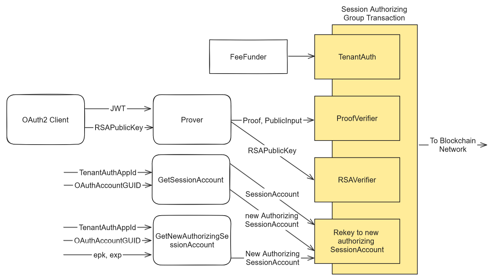
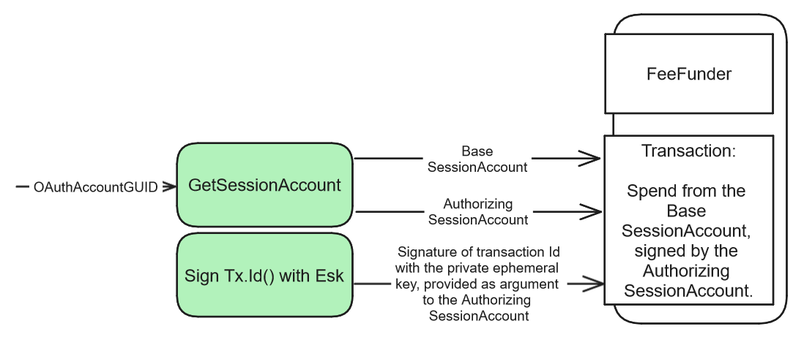

# Zorkin: Self-Custodial Account Access with Zero-Knowledge Methods

<p align="center">
  
</p>

# Self-Custodial Account Access with Zero-Knowledge Proof of Corresponding OpenIdConnect OAuth2 Account Ownership

## Introduction
#### About ZK-SNARKs
- Zero-Knowledge Succinct Non-Interactive Arguments of Knowledge (ZK-SNARKs) are advanced cryptographic tools that allow one party (the prover) to prove to another party (the verifier) that it possesses certain information without revealing the information itself. These proofs are remarkably small, making them quick to verify even on a blockchain, and they don’t require any interaction between the prover and verifier beyond the initial proof transmission.

#### Proving OAuth Account Ownership while preserving privacy

- Using ZK-SNARKs, it is possible to verify that a user has a valid JSON Web Access Token (JWT) for an account managed by OpenID Connect, which is a layer on top of the OAuth 2.0 protocol framework. This is done without exposing any sensitive token details. By combining specific fields from the JWT – issuer, audience, and subject – a unique identifier, the `OAuthAccountGUID`, can be generated, which represents the account in a privacy-preserving way. In a blockchain setting, ZK-SNARKs allow us to authenticate that the user is indeed linked to the `OAuthAccountGUID` without exposing the JWT or OAuth 2.0 credentials. This authentication is essential for secure transaction authorization. To enhance security and thwart replay attacks, a nonce (a number used once) is encoded within a user-definable claim of the JWT like the nonce claim (`CustomClaim`); it is generated by hashing a one-time-use ephemeral public key (`epk`) and a timestamp at which key expires. The corresponding private key (`esk`) signs a the transaction identifier, and this signature, along with the proof and hash pre-images, are given to the blockchain's verifier. This verification process ensures that only the rightful OAuth account owner, possessing the correct private key, can authorize transactions linked to the `OAuthAccountGUID`. All transactions have a unique lease value to prevent replay attacks, even within their respective validity range.

#### Authorizing a Session to Transact without additional Proof Verifications

- Once ownership of the `OAuthAccountGUID` is established, the ephemeral (temporary) key and its expiration timestamp can be used to control access to a secure session. In this session, the private key holder can approve further transactions using the same method without needing to generate new proofs or verifications. To facilitate this, a Logic Signature contract account called a `SessionAccount` is used. This `SessionAccount` has template variables for the ephemeral public key (`epk`), the expiration time (`exp`), the `OAuthAccountGUID` and the name of the  key for the `CustomClaim`. It contains logic that allows transaction approvals in line with the criteria defined above. The `CustomClaim` template variable is set to a value that will be used for the lifetime account, with a default value of 'nonce'. Initially, `SessionAccount` has placeholder values for `epk`, `exp` and only validates transactions providing proof of `OAuthAccountGUID` access. To establish an authorized session, `SessionAccount` is rekeyed to a new instance with the actual ephemeral public key and expiration time set for `epk` and `exp`. Subsequent transactions are approved if they either show proof of `OAuthAccountGUID` ownership or provide a valid signature of the transaction ID created with the private key corresponding to `epk`, provided the current time is before the session's expiration time (`exp`).

- Both the `SessionAccount` used for initial authorization and the session-enabling `SessionAccount` can be reconstructed without absolute reliability with only the `OAuthAccountGUID`. This is done by consulting the blockchain's transaction history using an indexer, which is a tool designed to query blockchain data efficiently. With the latest transaction data at hand, one can extract the logic governing the authorizing account. Likewise, the base `SessionAccount`, which is setup after the user logs in using the `OAuthAccountGUID`, can be recreated whenever necessary.

#### Ensuring JWT Authenticity

- To ensure that a JSON Web Token (JWT) is authentic, a decentralized application (dApp) checks it against a list of trusted JSON Web Keys (JWKs). This list is maintained on the blockchain and is periodically updated securely by importing fresh data from the issuer's JWK endpoint. The updates occur through a multi-party computation (MPC) process involving a decentralized service like ChainLink, which securely aggregates information from different external sources. Once the JWKs are fetched, they can be conveyed to various blockchains using a cross-chain interoperability protocol, such as Wormhole, which acts as a bridge, transferring and translating information between different blockchain networks, like Algorand.

- To improve user convenience, transaction fees are covered using a fee pooling mechanism. This approach allows transaction costs to be sponsored by a dedicated account or pool, removing the need for individual users to pay fees for each transaction. This task is managed in the background by a specialized stateful smart contract known as `FeeFunder`. While the internal workings of `FeeFunder` are beyond the scope of this summary, it is designed to facilitate fee payments on behalf of users, contributing to a seamless transaction experience.

#### Account Recovery

- Given that the association between a user and an OAuth2 client application can change over time, it is crucial to have a reliable and decentralized method for account recovery. To address this, the recovery mechanism, ZK-Email, is leveraged at the time of user registration. Using ZK-Email, if a user loses access to their account, they can prove ownership by demonstrating that they have access to a specific recovery email address that was initially used during the sign-up process. ZK-Email utilizes zero-knowledge proof technology to allow users to authenticate their email ownership without revealing sensitive information.

#### Authorized Session Revocation

The SessionAccount has a template variable for a public key of a key held by the user of the Zorkin service, which allows them to revoke any active session by rekeying the SessionAccount back to the base SessionAccount. This is useful in the event of SessionAccount loss of access for any reason, such as a malicious takeover or simply as a safety measure to prevent long range attacks that might utilise an old unexpired Session key.

#### Proof Generation Deferral

- The requirement for users to generate cryptographic proofs is deferred until such an action is necessary, for example when approving transactions without an active session. By postponing proof generation until it's explicitly required, the application can provide a more responsive initial login experience. Additionally, this strategy can lead to cost savings for the dApp's operators, as the computational expense of creating proofs is incurred only for users who go on to engage in activities like transactions that necessitate such proofs. This can notably reduce the burden on servers tasked with proof generation, aligning resource use with actual dApp interaction.

#### Differentiation & Improvements to Existing Work

- Zorkin advances the state of similar authentication technology in several ways when compared to existing solutions such as Sui's ZK-Login and the Snark-JWT-Verify library. Here are the key improvements made by Zorkin more clearly explained:

1. **Elimination of Salting Service Dependency**: Zorkin removes the dependency on a salting service for security purposes. Salting services add a layer of complexity and pose a potential vulnerability; if the salting service is compromised, it could lead to the loss of access to accounts. Furthermore, relying solely on a salting service does not mitigate the risk associated with an OAuth2 provider directly accessing accounts, as they have the authority to issue valid JWTs by design.

2. **Reduced Proof Verifications**: Another significant enhancement Zorkin offers is minimizing the frequency of proof verifications required for transaction authorization. By creating a trusted session that lasts for several hours, users do not need to generate new proofs for every transaction during that session. This reduction in verification needs leads to lower transaction fees and a smoother user experience.

3. **Deferred Proof Generation**: In line with providing a better user experience, Zorkin defers the generation of cryptographic proofs until the point when they are actually needed, such as when authorizing transactions. This approach relieves the server from the computational demands of generating proofs for every user upon log-in, especially beneficial when many users may not engage in transactions immediately. By deferring this intensive process, Zorkin ensures faster application loading times and optimizes resource utilization.

4. **Enhanced Flexibility with Authentication Providers**: Existing systems often depend on the ability to define a 'nonce' claim during the OAuth2 request to set up the ephemeral key. This presents a limitation because not all authentication solutions—like Firebase—allow programmatic control over user-definable claims. Zorkin's implementation uses a `CustomClaim`, which is a more flexible approach that is not restricted to a specific claim like 'nonce'. Hence, Zorkin's design allows it to work with a broader range of authentication providers that may not offer the same level of claim customization.

5. **Revocation of Active Sessions**: Zorkin allows users to revoke any active session by rekeying the SessionAccount back to the base SessionAccount, either using the ephemeral key itself, or remotely making use of the hardcoded creator public key which allows only the creator to revoke the session. This is useful in the event of SessionAccount loss of access for any reason, such as a malicious takeover or simply as a safety measure to prevent long range attacks that might utilise an old unexpired Session key.

These improvements focus on enhancing security, reducing costs, and offering a more adaptable and user-friendly Zero-Knowledge self-custodial authentication mechanism suitable for a variety of applications and authentication services.


#### Stateful Smart Contract Variant

- Rather than repeatedly rekeying the `SessionAccount` to manage authorized sessions, a more straightforward approach is to use an external stateful smart contract to keep track of session data. This alternative method would store session information in what's typically referred to as "box storage", a term used in the context of this text to describe the storage system utilized by the smart contract. However, regardless of the session management strategy chosen, it's essential to define the `SessionAccount` as a Logic Signature (also known as a smart signature). The Logic Signature is a key component that allows the `SessionAccount` to function in a manner similar to a standard Algorand wallet. Without it, the account would not have the flexibility required for general use, as smart contracts on their own cannot perform all actions of a wallet and have certain constraints that could prove restrictive. The Logic Signature essentially gives the `SessionAccount` the capability to authorize transactions in a secure and programmable way, ensuring that it adheres to the predefined rules embedded within it. The primary shortcoming of this variant is its inflexibility, as it deviates from behaving like a conventional wallet. Consequently, it may not be suitable for dApp transactions that anticipate interactions with a regular wallet and require a specific structure for group transactions.

## Method

The following provides a concise overview of the system. First we introduce the components to the solution, and later we describe protocols and procedures incorporating these procedures to achieve some of the functionality outlined in the introduction.

### Components of the Solution


#### JWTCircuit

The JWTCircuit is a ZK-SNARK circuit designed to relate the inputs together through equality constraints to assert that the JWT is signed with the specified RSA key, and the public input is a hash of the `OAuthAccountGUID`, the `CustomClaim` key & value denoted `CustomClaimKey` and `CustomClaimValue` respectively, and `RSAPublicKey`. `OAuthAccountGUID` is the hash of the issuer, audience and subject fields of the JWT.

```java
// The JWTCircuit's essential function is to confirm the validity of a private JWT key for a specific public identifier.
// MIMC7 and Poseidon denote cryptographic hashing algorithms.

JWTCircuit(private jwt, private RSAPublicKey, private CustomClaimKey, public publicInput):
  // Assert that the JWT has been signed with the provided RSA Public Key.
  assert RSAVerify(jwt, RSAPublicKey)
  // Utilize the Poseidon hash function to compute OAuthAccountGUID from issuer, audience, and subject claims in the JWT.
  OAuthAccountGUID = Poseidon(jwt.iss, jwt.aud, jwt.sub)
  CustomClaimValue = jwt[CustomClaimKey]
  // Deploy the MIMC7 hash function to calculate the public identifier (PublicInput) from OAuthAccountGUID, CustomClaimKey, CustomClaimValue, and RSAPublicKey.
  PublicInput = MIMC7(OAuthAccountGUID, CustomClaimKey, CustomClaimValue, RSAPublicKey)
  // Confirm that the computed PublicInput aligns with the publicInput supplied for verification.
  assert PublicInput == publicInput
```

The circuit, once compiled, manifests as a Groth16 ZK-SNARK proving system consisting of a verifier and a prover, using the BN254 elliptic curve for ECC. The verifier is described in terms of parameters referred to as `JWTVKey`. The verifier will verify proofs against a public input on-chain, along with the pre-image to the hash (`OAuthAccountGUID`, `CustomClaimKey`, `CustomClaimValue`, & `RSAPublicKey`). Successful verification, assuming replay attacks are prevented through signing with the ephemeral key specified in the `CustomClaimValue`'s pre-image, will prove that the sender is in possession of a JWT that was signed with the private key counterpart to the `RSAPublicKey` that grants access to the account uniquely identified by `OAuthAccountGUID`.

#### ProofVerifier

The `ProofVerifier` component functions as an on-chain logic signature designed to authenticate proofs supplied by the `JWTCircuit`-derived prover. Its primary role is to validate these proofs against specified public inputs, as well as the hash's pre-image components: `OAuthAccountGUID`, `CustomClaimKey`, `CustomClaimValue`, and `RSAPublicKey`. A successful verification demonstrates that the requesting party possesses a JWT authenticated by the corresponding private key of the `RSAPublicKey`. Consequently, this confirms their authorized access to the account identified by `OAuthAccountGUID`, assuming the absence of replay attacks whose mitigation is explained later.

Below is pseudocode for the `ProofVerifier` approval logic:
```python
# Define the hardcoded verification key based on JWTVKey parameters.
VKey = JWTVKey

def ProofVerifier(proof, publicInput):
    # Execute GROTH16 proof verification using the JWTVKey parameters
    # specifically tailored to our JWT circuit's verification needs.
    assert ProofIsValid(proof, publicInput, VKey)
```

In this implementation, the `ProofVerifier` function employs the GROTH16 verification algorithm, asserting the proof's validity predicated on the given public input and the statically defined `VKey`. It ensures that the proof meets all the verification criteria.

#### RSAVerifier

The `RSAVerifier` is a stateful smart contract on the blockchain which plays a pivotal role in maintaining the integrity of token authentication. It is tasked with the continuous updating of RSA public keys sourced from the JWKs (JSON Web Keys) endpoints of OAuth providers that support the OpenID Connect protocol. This updating process utilises secure multi-party computation mechanisms, ChainLink being an illustrative example.

Upon invocation of its function `UpdateOAuthJWKSCache`, the `RSAVerifier` performs a crucial authentication check: it compares the RSA public key presented in a transaction against its cache of trusted keys. This cache represents the current set of valid keys from known OAuth providers. Should a public key not be listed within this set, the `RSAVerifier` will categorically reject the transaction, thereby preventing any fraudulent authentication attempts involving the use of a maliciously signed unauthentic JWT.

The code snippet presents two functions integral to the `RSAVerifier` smart contract: `UpdateOAuthJWKSCache` and `ValidateOAuthRSAPublicKey` itself.

```python
# State management using BoxStorage, a construct analogous to Algorand's key-value pair storage
BoxStorage issuerRSAPublicKeys
string issuer
string MPCHTTPSClientAddress
string MPCHTTPSClientChain

# Function to update the session data for an existing SessionAccount
def ValidateOAuthRSAPublicKey(RSAPublicKey):
  # Ensure that the RSA public key matches one of the keys provided by the issuer
  assert issuerRSAPublicKeys[issuer].has(RSAPublicKey)

# Function to update the cache of RSA public keys for the OAuth issuer
def UpdateOAuthJWKSCache(VAAMessage):
  # Verify the message's validity from Wormhole's core module
  assert Wormhole.Core.MessageIsValid(VAAMessage)
  # Check if the sender and source chain match the expected MPC HTTPS client and chain
  assert VAAMessage.sender == MPCHTTPSClientAddress
  assert VAAMessage.source_chain == MPCHTTPSClientChain
  # Update the JWK cache with the new set of keys from the message
  keys := VAAMessage.keys
  issuer := VAAMessage.issuer
  issuerRSAPublicKeys[issuer] = keys
```

The `UpdateOAuthJWKSCache` function updates a smart contract's cache of OAuth issuer RSA public keys when a new key set arrives within a `VAAMessage`. This message is presumed to be coming from a trustworthy MPC system, appropriately authenticated through the Wormhole infrastructure. The function validates the message with `Wormhole.Core.MessageIsValid` and also verifies that it is sent from the expected MPC HTTPS client and its originating chain. Subsequently, it updates the issuer's corresponding entry in `issuerRSAPublicKeys` with the new keys.

The `ValidateOAuthRSAPublicKey` function checks if a given RSA public key, as part of an OAuth validation process, exists within the contract's cache of keys related to a specific issuer. It does this by asserting that the public key is contained within the set of keys associated with the issuer in the `issuerRSAPublicKeys` storage. If the assertion fails, the key is deemed invalid, and the validation process is terminated, ensuring only transactions with recognized and valid RSA public keys are allowed.

#### FeeFunder

The `FeeFunder` is an LSIG that can be invoked by anyone, however it will only approve an application call to the `FeeFunderState` application to assert that the sessionAccountAddr is a registered SessionAccount; and that the transaction is apart of a group that corresponds to the rekeying of the SessionAccount to a new authorizing SessionAccount to establish a new state. FeeFunder is intended to cover fees associated with the transaction group, and is funded by an external account, such as by Zorkin. It asserts exactly the right fee is paid, to prevent fee draining exploits. 

```python
# State management using BoxStorage
BoxStorage session

# Function to register a new SessionAccount
def RegisterSessionAccount(sessionAccountAddr):
  # Assert the sender is the Creator of this applciation
  assert Txn.sender == AppParam.creator(0)
  # Add the SessionAccount address to the BoxStorage with an initial empty state
  session[sessionAccountAddr] = []

# Function to deregister an existing SessionAccount
def DeregisterSessionAccount(sessionAccountAddr):
  # Assert the sender is the Creator of this applciation
  assert Txn.sender == AppParam.creator(0)
  # Remove the SessionAccount address from the BoxStorage
  delete session[sessionAccountAddr]'

# Function to check whether a specific SessionAccount is registered
def SessionAccountIsRegistered(sessionAccountAddr):
  # Anyone can query this function
  assert session.has(sessionAccountAddr)
```

```python
FeeFunderStateAppId = TMPL('FEEFUNDERSTATEAPPID')
string ProofVerifierAddr # Hardcoded Address of the verifier LSIG
string RSAVerifierAppId # Hardcoded App ID of the RSA Verifier

def FeeFunder():
  # Assert the Txn is an application call to FeeFunderState smartcontract, with application id FeeFunderStateAppId
  assert Txn.appId == FeeFunderStateAppId
  # Assert the Txn is calling the RegisterSessionAccount function
  assert Txn.application_args[0] == "SessionAccountIsRegistered"
  sessionAccountAddr := Txn.application_args[1]
  # Assert the Txn is within a group corresponding to the SessionAccount with address sessionAccountAddr
  # that rekeys the SessionAccount to a new authorizing SessionAccount to establish a session
  assert Gtxn[1].addr == ProofVerifierAddr
  assert Gtxn[2].appId == RSAVerifierAppId
  assert Txn.group_size == 4
  assert Gtxn[3].type == "rekey"
  assert Gtxn[3].sender == sessionAccountAddr
  assert Gtxn[3].rekeyTo != sessionAccountAddr
  # Assert the Txn has a fee that's the exact amount to cover the session authorization
  assert Txn.fee() == 4 * Global.MinTxnFee
  # Plus any additional conditions to ensure the transaction is valid...
```


#### SessionAccount

The `SessionAccount` is a Logic Signature Account that holds the user's assets. It's assumed that the authorizing address is always an instance of a SessionAccount with the same `OAuthAccountGUID`, but different authorizing session access parameters `epk` (ephemeral public key) that has private key `esk` and `exp` (expiry of the session).

Spending transaction authorization is granted by the approval logic if:
- The user provides a signature of the transaction Id signed with `esk` and isn't expired (i.e. `exp` < `Txn.lastValidity`), and it's post account creation (i.e. `epk` != `DefaultEphemeralKey`).
- The user submits a valid proof and public input, demonstrating access to the OAuth2 account identified by `OAuthAccountGUID`, and signs the transaction Id with the `newEpk` private key which is in the pre-image to the `CustomClaimValue`. A signature of the transaction Id by the private key of the `newEpk` is provided as an argument to the `SessionAccount` LSIG and is verified to prevent replay attacks.
\
\
Upon rekeying to a new authorizing `SessionAccount` with access to the initial account, the user is considered to be in an authorized session.

To mitigate replay attacks, verification incorporates signing with a one-time-use ephemeral key, as outlined by the `CustomClaimValue`'s pre-image. The verification key, labeled as `JWTVKey`, is embedded in the circuit and thus establishes a unique address correlating to the verification key parameters. This exclusivity permits subsequent transactions to verify that the characteristics of the verifier conform to those defined by `JWTVKey`.

```python
# Define constants and templates.
DefaultEphemeralKey = Bytes(16, "0xDEADBEEF")
ExpTemplate = TMPL('TMPL_EXP')
EpkTemplate = TMPL('TMPL_EPK')
CustomClaimKeyTemplate = TMPL('TMPL_CUSTOMCLAIMKEY')
OAuthAccountGUIDTemplate = TMPL('TMPL_OAUTHACCOUNTGUID')
string ProofVerifierAddr # Hardcoded Address of the verifier LSIG
string RSAVerifierAppId # Hardcoded App ID of the RSA Verifier
string CreatorAddr # Hardcoded Address of the Zorkin user that created this LSIG Account for one of their users

# Define a function to validate the JWT proof.
def hasOAuthAccountAccess(sig):
    """
    Validate JWT proof to confirm ownership of the OAuth account.

    This function will be triggered upon rekeying to an authorizing SessionAccount with updated 
    ephemeral public key (EPK) and expiration (EXP) parameters upon valid JWT presentation.
    """
    # Confirm rekeying to SessionAccount with new EPK and EXP values tied to the OAuthAccountGUID.
    assert Txn.type == "rekey"
    assert Txn.groupSize == 4
    assert Txn.groupIndex == 3

    # Retrieve pre-image parameters from the transaction note.
    epk, exp, RSAPublicKey = Txn.note()

    # Verify the JWT signature with the issuer's public key registered at the RSAVerifierApp.
    RSAVerifierTxn = Gtxn[2]
    assert RSAVerifierTxn.application_id == RSAVerifierAppId
    assert RSAVerifierTxn.application_args[0] == "ValidateOAuthRSAPublicKey"
    assert RSAVerifierTxn.application_args[1] == RSAPublicKey

    # Ensure that a valid proof of JWT ownership is provided by the sender.
    CustomClaimValue = Sha256(epk, exp)
    PublicInput = MIMCHash(OAuthAccountGUIDTemplate, CustomClaimKeyTemplate, CustomClaimValue, RSAPublicKey)
    proofVerifierTxn = Gtxn[1]
    assert proofVerifierTxn.sender == ProofVerifierAddr
    assert proofVerifierTxn.note == PublicInput

    # Verify that the ephemeral key signs the transaction ID to prevent proof replay attacks.
    assert ED25519_Verify(sig, Txn.transaction_id, epk)
    assert exp < Txn.last_valid_round
    # Additional validation to ensure access to the OAuth account can be included here.

    # If all conditions are satisfied, the JWT proof is valid.
    return True

# Assert that the creator is only attempting to revoke any active by rekeying the SessionAccount back to the root base SessionAccount
def creatorIsOnlyRevokingActiveSession():
    assert Txn.type == "rekey"
    # Tnx.sender is the address of the initial SessionAccount
    assert Txn.rekeyTo == Txn.sender
    # Assert the fee is the exact amount
    assert Txn.fee() == 1 * Global.MinTxnFee
    # Assert there's only one transaction in the group
    assert Txn.groupSize == 1

# Entry point for LSIG (Logic Signature) execution.
def SessionAccount(sig):
    """
    Main function representing the Logic Signature for the SessionAccount.

    This function determines whether a transaction is approved based on the session state.
    """
    
    # Case: Revocation of any active session to the base account
    if ED25519_Verify(sig, Txn.transaction_id, CreatorAddr):
        # Assert the creator is only attempting to revoke any active session
        assert creatorIsOnlyRevokingActiveSession()

    # Case: Base state, representing first session creation
    if EpkTemplate == DefaultEphemeralKey:
        # Rekeying to authorize a new SessionAccount as the authorizing address has fees covered by an external FeeFunder account.
        assert Txn.fee() == 0
        # Validate the sender has access to the corresponding OAuth account, and that proof replay attacks are prevented. 
        assert hasOAuthAccountAccess(sig) 

    # Case: Using an active session (Session usage).
    elif (ED25519_Verify(sig, Txn.transaction_id, EpkTemplate) and
          ExpTemplate < Txn.last_valid_round): 
        # Approve the transaction if it is signed by the ephemeral key and within the session validity.
        Approve()

    # Case: Rekeying to a new SessionAccount to authorize a new session.
    else:
        # Rekeying to authorize a new SessionAccount as the authorizing address has fees covered by an external FeeFunder account.
        assert Txn.fee() == 0
        # Validate the sender has access to the corresponding OAuth account, and that proof replay attacks are prevented.
        assert hasOAuthAccountAccess(sig)
```

#### SessionAccount Reproduction

When spending from a `SessionAccount`, the LSIG program code for both the account and its *authorizing* `SessionAccount` must be reproduced (see [Rekeying in Algorand](https://developer.algorand.org/docs/get-details/accounts/rekey/)). The spending account is the base account, while the authorizing account provides authorization.
\
\
Reproducing the base account involves creating a `SessionAccount` LSIG instance using the known `OAuthAccountGUID` value for the template variable and default values for the remaining variables.
\
\
Reproducing the authorizing account entails using an Indexer for efficient blockchain state querying to obtain the last transaction of the known authorizing address. This data is then used to create an authorizing `SessionAccount` LSIG instance with the relevant template variables.

```python
DefaultEphemeralKey = Bytes(16, "0xDEADBEEF")
def GetBaseAccount(OAuthAccountGUID, CustomClaimKey='nonce'):
  return SessionAccount({TMPL_OAUTHACCOUNTGUID: OAuthAccountGUID, TMPL_EPK: DefaultEphemeralKey, TMPL_EXP: 0, TMPL_CUSTOMCLAIMKEY: CustomClaimKey})})

def GetAuthorizingAccount(OAuthAccountGUID, CustomClaimKey='nonce'):
  # Get the last transaction of the authorizing address
  baseAccount = GetBaseAccount(OAuthAccountGUID)
  authorizingAddress = baseAccount['auth-addr']
  lastAuthTxn = Indexer.GetLastTxn(authorizingAddress)
  if lastAuthTxn == None:
    return GetBaseAccount(OAuthAccountGUID)
  # Get the template variables from the last transaction
  epk, exp, customClaimKey = ReadTemplateVariables(lastAuthTxn)
  return SessionAccount({TMPL_OAUTHACCOUNTGUID: OAuthAccountGUID, TMPL_EPK: epk, TMPL_EXP: exp, TMPL_CUSTOMCLAIMKEY: customClaimKey})

def GetSessionAccount(OAuthAccountGUID, CustomClaimKey='nonce'):
  return [GetBaseAccount(OAuthAccountGUID, CustomClaimKey), GetAuthorizingAccount(OAuthAccountGUID)]

def GetNewAuthorizingSessionAccount(OAuthAccountGUID, newEpk, newExp, customClaimKey):
    return SessionAccount({TMPL_OAUTHACCOUNTGUID: OAuthAccountGUID, TMPL_EPK: newEpk, TMPL_EXP: newExp, TMPL_CUSTOMCLAIMKEY: customClaimKey})
```

### Account Creation

When a user first creates a SessionAccount account, they reproduce the SessionAccount where the authorizing account must match the base account as it is yet to be rekeyed. To create a new authorized session wherein they can spend from the account with a temporary ephemeral signing key, they must first prove access to the corresponding OAuth2 account identified by `OAuthAccountGUID` that delegates temporary spending authority to their specified ephemeral key as explained in the next Section.


### Authorize a new Session

To initiate a new session, a base SessionAccount is rekeyed to a time-bound authorizing SessionAccount. This authorization allows for access to the base account, but only through transactions signed with the associated ephemeral private key. The transaction ID used in the process is required to be verified by this signature. Authorization requires demonstrating control over a valid JWT OAuth access token, which is associated with the user's OAuth2 account identified by `OAuthAccountGUID`. The token must encode the ephemeral public key and the new authorizing SessionAccount's expiration period, indicated as 'validity rounds', within the `CustomClaimValue`.
\
\
The procedure is the following:
1. Create a new ED25519 keypair for the ephemeral key, with the public key `epk` and private key `esk`. Specify the expiration validity of the new authorizing SessionAccount as `exp`.
2. Request a JWT from the OAuth2 provider, such as Google, using the OAuth2 OpenIDConnect protocol, with a `CustomClaimValue` of `Sha256(epk, exp)`. The JWT should be signed with the RSA public key `RSAPublicKey` of the OAuth2 provider.
3. Derive the `OAuthAccountGUID` as `Poseidon(jwt.iss, jwt.aud, jwt.sub)`, where `jwt.iss` is the OAuth2 provider identifier, `jwt.aud` is the OAuth2 client identifier, and `jwt.sub` is the OAuth2 user identifier.
4. Provide private the JWT and `RSAPublicKey` as private inputs and the public input as `MIMCHash(OAuthAccountGUID, CustomClaimKey, CustomClaimValue, RSAPublicKey)` to the prover. The prover will return a `proof` and public input `publicInput`, if the proof is valid.
5. Reproduce the base SessionAccount and its authorizing SessionAccount using the `OAuthAccountGUID` by calling the `GetSessionAccount` function.
6. Create a new Authorizing SessionAccount with the `epk` and `exp` using the `GetNewAuthorizingSessionAccount` function, which will be used to rekey the base SessionAccount.
7. Submit a transaction group, called a Session Authorizing Transaction, with the following transactions:
    - Transaction 0: An application call to `FeeFunderState` with argument specifying the address of the base SessionAccount address, from the `FeeFunder` LSIG to cover fees associated with the transaction group.
    - Transaction 1: A self-payment of 0 to the `ProofVerifier` with the `proof` as an argument (the `publicInput` is specified in the note for communication to other transactions in the group).
    - Transaction 2: An application call to `ValidateOAuthRSAPublicKey` of the `RSAVerifier` application with the `RSAPublicKey` provided as an application argument.
    - Transaction 3: A rekey of the base SessionAccount to the new authorizing SessionAccount, signed by the current authorizing SessionAccount LSIG. The note is set to an array containing the values of the `CustomClaimValue` pre-image (`epk` and `exp`), and `RSAPublicKey`. A signature of the transaction Id by `esk` is added as an LSIG argument. A random lease value is provided to ensure the transaction Id is unique, and to prevent replay attacks even of the same transaction.

The atomic nature of group transactions ensures failure of the entire group if any single transaction does not succeed. Concurrently, the group's successful processing confirms the sender's control over a valid JWT access token linked to the OAuth account designated by `OAuthAccountGUID`. This is evidenced by the verified proof, the signature with a verified RSA public key from the OAuth provider's JWK endpoint, and by the rekey transaction ID, which must be signed with the ephemeral private key from the JWT's `CustomClaimValue` pre-image to avoid replays. The randomness and replay protection are further assured by the utilization of a random lease value.




### Spending within an Authorized Session

Once a user has authorized a new session, they can spend from the account with the `newEsk` private key until the `newExp` validity rounds have passed by providing a signature of the transaction Id by `newEsk` as an argument to the `SessionAccount` LSIG. The base SessionAccount and Authorizing SessionAccount are reproduced as explained in the previous section. Additionally the lease field is set to a random value each time, to ensure the transaction Id is unique and prevent replay attacks even for the same transaction.

1. Reproduce the base SessionAccount and its authorizing SessionAccount using the `OAuthAccountGUID` by calling the `GetSessionAccount` function.
2. Sign a spending transaction, after assigning a random value to the lease field, with the the authorizing SessionAccount with an argument of the transaction Id signed by `newEsk`.
3. Add the transaction to a group transaction that includes an application call to `FeeFunder`, which will cover transaction fees through fee pooling.
4. Submit the transaction to the network.





### Account Recovery

To simplify, account recovery in Zorkin, not previously mentioned, involves adding a recovery factor to the SessionAccount for access restoration, like if a client goes offline. A proposed recovery method is using [ZK-Email](https://prove.email/) to send a recovery email at account creation. The user then verifies access to this email, linked to the SessionAccount through elements like the DKIM email signature RSA public key and their email address as template variables.

### Proof Generation Deferral

Proof generation by a remote prover, which can be resource-intensive, is postponed until required for signing to optimize costs and loading times. This enhances user experience, as many dApp users, like those browsing an NFT marketplace, don't immediately transact. Once generated, a proof needs only a single verification for session establishment (i.e., rekeying), allowing subsequent spending without further proof production or verification until expiration, thereby reducing authentication fees and prover server costs.

## Differentiation & Improvements to Existing Work

- Zorkin advances the state of similar authentication technology in several ways when compared to existing solutions such as Sui's ZK-Login and the Snark-JWT-Verify library. Here are the key improvements made by Zorkin more clearly explained:

1. **Elimination of Salting Service Dependency**: Zorkin removes the dependency on a salting service for security purposes. Salting services add a layer of complexity and pose a potential vulnerability; if the salting service is compromised, it could lead to the loss of access to accounts. Furthermore, relying solely on a salting service does not mitigate the risk associated with an OAuth2 provider directly accessing accounts, as they have the authority to issue valid JWTs by design.

2. **Reduced Proof Verifications**: Another significant enhancement Zorkin offers is minimizing the frequency of proof verifications required for transaction authorization. By creating a trusted session that lasts for several hours, users do not need to generate new proofs for every transaction during that session. This reduction in verification needs leads to lower transaction fees and a smoother user experience.

3. **Deferred Proof Generation**: In line with providing a better user experience, Zorkin defers the generation of cryptographic proofs until the point when they are actually needed, such as when authorizing transactions. This approach relieves the server from the computational demands of generating proofs for every user upon log-in, especially beneficial when many users may not engage in transactions immediately. By deferring this intensive process, Zorkin ensures faster application loading times and optimizes resource utilization.

4. **Enhanced Flexibility with Authentication Providers**: Existing systems often depend on the ability to define a 'nonce' claim during the OAuth2 request to set up the ephemeral key. This presents a limitation because not all authentication solutions—like Firebase—allow programmatic control over user-definable claims. Zorkin's implementation uses a `CustomClaim`, which is a more flexible approach that is not restricted to a specific claim like 'nonce'. Hence, Zorkin's design allows it to work with a broader range of authentication providers that may not offer the same level of claim customization.

5. **Revocation of Active Sessions**: Zorkin allows users to revoke any active session by rekeying the SessionAccount back to the base SessionAccount, either using the ephemeral key itself, or remotely making use of the hardcoded creator public key which allows only the creator to revoke the session. This is useful in the event of SessionAccount loss of access for any reason, such as a malicious takeover or simply as a safety measure to prevent long range attacks that might utilise an old unexpired Session key.

These improvements focus on enhancing security, reducing costs, and offering a more adaptable and user-friendly authentication mechanism suitable for a variety of applications and authentication services.

## Variant: Stateful Smart-Contract to Maintain the authorized Session

This is a variant of Zorkin that maintains SessionState in the BoxStorage of a stateful SmartContract called SessionState, which allows for the creation of Authorized sessions within which the user can issue transactions from the SessionAccounnt by signing the Transction Id with the ephemeral private key if its public key is recorded in the session and is has a Last Validity that's before the recorded expiration in the BoxStorage. To account for how a SessionAccount initially has an empty balance, and to streamline authentication, fees are covered by SessionStateInvoker which is an LSIG account that is only allowed to make application calls to SessionState. Anyone can reproduce SessionStateInvoker, however it will only pass if it's calling the SessionState as expected, and that the SessionAccount involved has been registered. A SessionAccount is considered registered if it has been recorded into the session BoxStorage of SessionState, which occurs when a SessionAccount is first created. SessionState takes on the role of validating the RSA public key against a cache of known JWKs for the  OAuth2 issuer as requested from their endpoint via an MPC HTTPs request, which periodically updates the cache. As before, SessionAccount is still responsible for asserting that the expected ProofVerifier is in the group transaction and is verifying a proof against the public input whose verification would prove ownership of the linked OAuth2 account identified by OAuthAccountGUID.
\
The primary shortcoming of this variant is its inflexibility, as it deviates from behaving like a conventional wallet. Consequently, it may not be suitable for dApp transactions that anticipate interactions with a regular wallet and require a specific structure for group transactions.

#### SessionStateInvoker

An LSIG that makes application calls to the SessionState LSIG, covering fees for the entire group. It is only allowed to call the dApp, and must be topped up by the smart contract or a human in the loop to have sufficient balance to cover fees. 
```python
SessionStateAppId = TMPL('TMPL_SESSIONSTATEAPPID')
# LSIG Entry point
def SessionStateInvoker():
  # Should only ever call the SessionState application. Assert this is the case.
  assert Txn.type == 'appl'
  assert Txn.appId == SessionStateAppId
  # Assert it's calling either UpdateSession or HasActiveSession, and react accordingly
  if Txn.appArgs[0] == 'UpdateSession':
    # UpdateSession requires a fee of 3 microAlgos, covering all authentication fees involved
    assert Txn.fee() == 3 * Global.MinTxnFee
  elif Txn.appArgs[0] == 'HasActiveSession':
    # When asserting SessionAccount is authorized to transact in an authorized session, another sender covers the fees
    assert Txn.fee() == 0
  else:
    Reject()
```

#### SessionState

```python
# State management using BoxStorage
BoxStorage session
BoxStorage issuerRSAPublicKeys
string issuer
string MPCHTTPSClientAddress
string MPCHTTPSClientChain

# Function to update the session data for an existing SessionAccount
def UpdateSession():
  # Retrieve the session update transaction, assuming it's the second in the group (index 1)
  sessionUpdateTxn := Gtxn[1]
  # Verify that it's a zero-amount payment transaction from the SessionAccount to itself
  assert sessionUpdateTxn.type == "pay"
  assert sessionUpdateTxn.amount == 0
  assert sessionUpdateTxn.receiver == sessionUpdateTxn.sender
  # Check that the SessionAccount has previously been registered
  assert session.has(sessionUpdateTxn.sender)
  # Extract the ephemeral public key (Epk), expiration time (Exp), and RSA public key from the note field
  Epk, Exp, RSAPublicKey := sessionUpdateTxn.note()
  # Update the session data in the BoxStorage with the new details
  session[sessionUpdateTxn.sender] = [Epk, Exp]
  # Ensure that the RSA public key matches one of the keys provided by the issuer
  assert issuerRSAPublicKeys[issuer].has(RSAPublicKey)

# Function to check if there is an active session for the SessionAccount based on the ephemeral signature (EskSig)
def HasActiveSession(EskSig):
  # Ensure there are at least two transactions in the group
  assert Global.group_size >= 2
  # Retrieve the payment transaction from the SessionAccount, assumed to be second in the group (index 1)
  sessionAccountTxn := Gtxn[Global.group_index + 1]
  # Check that the SessionAccount is registered
  assert session.has(sessionAccountTxn.sender)
  # Fetch the session details (Epk, Exp) for the sender, which is the SessionAccount
  Epk, Exp := session[sessionAccountTxn.sender]
  # Verify that EskSig is a valid signature for the transaction ID using the ephemeral public key (Epk)
  assert ED25519_Verify(sessionAccountTxn.id, EskSig, Epk)
  # Ensure the current transaction timestamp is earlier than the session expiration time (Exp)
  assert sessionAccountTxn.last_valid < Exp

# Function to update the cache of RSA public keys for the OAuth issuer
def UpdateOAuthJWKSCache(VAAMessage):
  # Verify the message's validity from Wormhole's core module
  assert Wormhole.Core.MessageIsValid(VAAMessage)
  # Check if the sender and source chain match the expected MPC HTTPS client and chain
  assert VAAMessage.sender == MPCHTTPSClientAddress
  assert VAAMessage.source_chain == MPCHTTPSClientChain
  # Update the JWK cache with the new set of keys from the message
  keys := VAAMessage.keys
  issuer := VAAMessage.issuer
  issuerRSAPublicKeys[issuer] = keys

# Function to register a new SessionAccount
def RegisterSessionAccount(sessionAccountAddr):
  # Assert the sender is the Creator of this applciation
  assert Txn.sender == AppParam.creator(0)
  # Add the SessionAccount address to the BoxStorage with an initial empty state
  session[sessionAccountAddr] = []

# Function to deregister an existing SessionAccount
def DeregisterSessionAccount(sessionAccountAddr):
  # Assert the sender is the Creator of this applciation
  assert Txn.sender == AppParam.creator(0)
  # Remove the SessionAccount address from the BoxStorage
  delete session[sessionAccountAddr]
```

#### Modified SessionAccount
```python
CustomClaimKey = TMPL('TMPL_CUSTOMCLAIMKEY')
OAuthAccountGUID = TMPL('TMPL_OAUTHACCOUNTGUID')
SessionStateAppId = TMPL('TMPL_SESSIONSTATEAPPID')
ProofVerifierAddr = TMPL('TMPL_PROOFVERIFIERADDR')

# Validates the JWT proof for OAuthAccountGUID ownership
def validJWTProof():
    assert Txn.type == "pay"  # The transaction should be a payment type
    assert Global.group_size == 3  # Ensure there are three transactions in the group
    assert Txn.group_index == 1  # This transaction must be the second in the group
    
    # Extract parameters from the note field expected to be formatted as [Epk, Exp, RSAPublicKey, Sig]
    (Epk, Exp, RSAPublicKey, Sig) = Txn.note()
    
    # Sha256 hash of Epk and Exp to produce the CustomClaimValue
    CustomClaimValue = Sha256(Txn.note().Epk, Txn.note().Exp)
    
    # The public input is a MiMC hash of the OAuthAccountGUID, CustomClaimKey, CustomClaimValue, and RSAPublicKey
    PublicInput = MIMCHash(OAuthAccountGUID, CustomClaimKey, CustomClaimValue, RSAPublicKey)
    
    # Ensure the third transaction in the group is from the ProofVerifierAddr with the expected PublicInput
    assert Gtxn[2].sender == ProofVerifierAddr
    assert Gtxn[2].note() == PublicInput  # Assuming the note holds the public input
    
    # Check that the transaction ID is signed with the provided signature and ephemeral public key
    assert ED25519_Verify(Txn.id, Sig, Epk)
    # Check that the current time is before the expiration time from the note field
    assert Global.latest_timestamp < Exp

# Logic Signature entry point for the SessionAccount
def SessionAccount():
    # Verify that the previous transaction is an application call to the SessionState with the correct AppId
    assert Gtxn[Txn.group_index - 1].type == 'appl'
    assert Gtxn[Txn.group_index - 1].application_id == SessionStateAppId
    
    # Retrieve the name of the session state function being called from the application args
    sessionStateFcnName = Gtxn[Txn.group_index - 1].application_args[0]
    
    # If update session function is being called within the SessionState smart contract
    if sessionStateFcnName == 'UpdateSession':
        # Ensure that this transaction does not pay fees (fees are covered by another transaction in the group)
        assert Txn.fee == 0
        # Validate the proof to update the session, assuming SessionState will handle session updates
        validJWTProof()
    
    # If checking for an active session within the SessionState smart contract
    elif sessionStateFcnName == 'HasActiveSession':
        # Approve the transaction if an active session is present, handled by SessionState verification
        Approve()
    
    # Reject in all other cases
    else:
        Reject()
```

## Future Work

We plan to enhance our methodology with the following initiatives:

1. Improve the Zero-Knowledge Email (ZK-Email) recovery process.
2. Ensure rekeying is only permitted for SessionAccount instances associated with the same OAuth account, to enhance security.
3. Explore strategies for offloading computation from the prover server by increasing the use of on-chain verifications.
4. Investigate methods to streamline the user experience, particularly with regards to the Algorand 'Opt-In' procedure for receiving an asset and addressing issues related to the Minimum Balance Requirement (MBR) that is necessary when opting in to receive an asset on the Algorand blockchain.

We have already established a technique for restricting rekeying. This approach involves generating the program code on-chain by inputting the specific parameters during a rekey transaction. This code is then hashed to generate an address. By comparing this address with the address in the rekey field, we can confirm if the rekeying is targeting a legitimate session account.

## Contribution Statement

Authored by Winton Nathan-Roberts of Sydney, Australia, this document details original work distinct from existing literature to the best of my knowledge. Novel contributions include its approach in implementing OAuth2 self-custodial access by recursively regenerating and rekeying SessionAccount LSIGs, the elimination of a salting service, proof generation deferral, decentralized recovery options and reduction in gas fees associated with constant proof verification. Thanks to the Algorand community for their support.
\
\
All Rights Reserved with Copyright.

## Disclaimer

This content, including texts, graphics, code, etc., is for informational purposes and provided 'as is' without guarantees.

- NO WARRANTIES: We offer no warranties or guarantees, explicit or implied.
- NO LIABILITY: We are not liable for any damages from using or inability to use this content.
- INDEPENDENCE: We do not necessarily have a direct affiliation with any party mentioned or implied besides Zorkin.
- INDEMNIFICATION: You must defend and indemnify us against all claims and damages from your use of the content.
- NOT PRODUCTION READY: The content may have vulnerabilities and is not for production use.
- USE AT YOUR OWN RISK: You are solely responsible for using the content and ensuring its legal compliance.
- UNVERIFIED CLAIMS: Claims in the content are not independently verified; do your own research before relying on them.

This disclaimer is applied to the fullest extent permitted by law. By using the content, you accept these terms. Note: This disclaimer was assisted by AI and I am not a legal professional. TLDR: it's an idea and an MVP, that I may or may not continue to work on at my discretion. Everything is subject to change, including the name.
