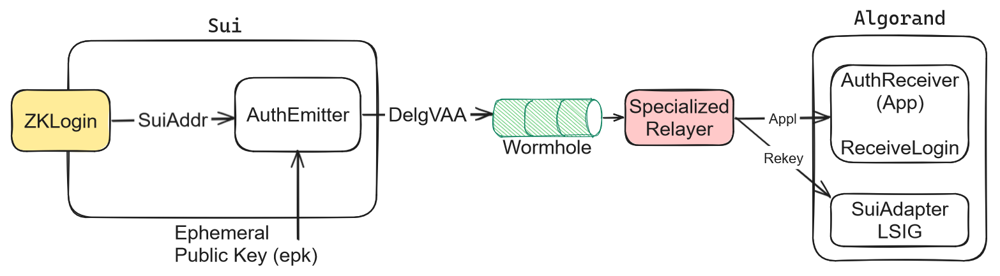

# Zorkin: Using ZKLogin by Sui on Algorand & beyond through Bridging

**Disclosure: I am currently engaged in developing this into an MVP and potentially into production as quickly as possible. I may patent my system design if it turns out to be patentable upon further research.**

<p align="center">
  
</p>


The innovative [ZKLogin by Sui](https://sui.io/zklogin) utilizes ZK-SNARKS technology to provide secure OAuth2-based access to Sui accounts through OpenIDConnect service providers like Google. It uniquely confines spending key material within the browser client and ensures JWTs remain off-chain, significantly enhancing security.

This proposal aims to make ZKLogin usable on [Algorand](https://developer.algorand.org/docs) blockchain. I plan to achieve this while preserving its core functionalities, utilizing the [Wormhole bridge](https://docs.wormhole.com/wormhole/quick-start/cross-chain-dev). Our approach is designed to be flexible, enabling adaptation to various blockchains and ZK service providers needing integration with an additional blockchain.

## Introductory Video
<p align="center">
  <a href="https://www.youtube.com/watch?v=dfXH1JM-BDY">
    
  </a>
</p>


## Method

This document outlines a method that incorporates three main components, with their respective pseudocode descriptions provided below for reference:

1. `AuthEmitter` application deployed on the [Sui blockchain](https://github.com/MystenLabs/sui).
2. `AuthReceiver` application deployed on the [Algorand blockchain](https://www.algorand.com/).
3. A [Logic Signature (LSIG) Contract Account](https://developer.algorand.org/docs/get-details/dapps/smart-contracts/smartsigs/modes/#contract-account) named `SuiAdapter` on Algorand, access to which is secured by `ZKLogin`. 

The `AuthEmitter` is responsible for initiating a message once a user is logged in. This message, containing both the user's Address and their ephemeral key, is propagated to the `AuthReceiver` on Algorand via the [Wormhole bridge](https://docs.wormhole.com/wormhole/quick-start/cross-chain-dev/specialized-relayer). A specialized relayer is used to capture this message and perform an application call to `AuthReceiver`. The call includes a transaction that rekeys the existing `SuiAdapter` to a new `SuiAdapter` account. This new account is controlled by the ephemeral key belonging to the session's logged-in user.

Rekeying the `SuiAdapter` ([Algorand’s rekeying feature](https://developer.algorand.org/docs/get-details/accounts/rekey/)) involves updating the LSIG account with the current session’s ephemeral key. When rekeyed, the `SuiAdapter` maintains its assets but now authorizes transactions using the new ephemeral key.

The `AuthEmitter` also has the functionality to store the previously used ephemeral key using Box Storage. This stored key enables the reconstruction of the prior `SuiAdapter`, from which the new `SuiAdapter` is derived. To ensure security, the method enforces that a rekey operation can only occur if:

- The `AuthEmitter` confirms the correctness of both the current and rekeyed `SuiAdapter` addresses.
- The rekey transaction is part of a valid group transaction including the message from `AuthEmitter`.

Note that group transactions on Algorand are atomic, meaning all transactions in the group must succeed together, or they all fail.

Leveraging the static authorizing address of the derived `SuiAdapter`, we can identify the underlying account address with simple indexing. This address does not change between login sessions and is used to initiate transactions from the `SuiAdapter` using its 'from' field. Spending transactions from the address are signed with the current Sui Adapter where the ephemeral public key and signature of the transaction id using the ephemeral private key are provided. The SuiAdapter will approve the transaction if the ephemeral public key matches the bound template variable, and the signature is valid.



In the following subsections, we describe the method in greater detail with pseudocode. Please note the minute details are not significant to the overall method and are skimmed over for brevity.

### Step 1: Initiate Login and Message Emission on Sui (ZKLogin to AuthEmitter)
- **Login via ZKLogin**: The user logs in to their Sui account using ZKLogin. This action generates a unique, temporary ED25519 key pair (ephemeral public key (epk) and ephemeral secret key (esk)) for the session.
- **Message Emission**: The AuthEmitter contract on Sui is invoked by the logged in Sui account. This contract sends a message through the Wormhole bridge to the AuthReceiver application on Algorand, if the transaction was initiated by the corresponding Sui account. This message, referred to as the Delegating VAA (DelgVAA), includes the Sui account address (suiAddr) and the ephemeral public key (epk).

### Step 2: Message Relay and Rekeying on Algorand

- **Message Relay**: A specialized Wormhole relayer forwards the DelgVAA message from Sui's AuthEmitter to Algorand's AuthReceiver. This message contains the Sui account address and the new ephemeral public key.

- **Rekeying SuiAdapter**: The AuthReceiver on Algorand initiates a rekey transaction for the SuiAdapter LSIG account. This transaction updates the SuiAdapter with the new ephemeral key from the DelgVAA, changing the authorizing address while keeping the assets intact.

- **Security and Validation**: The previous ephemeral key, stored in the AuthEmitter's Box Storage on Sui, is used to validate the rekey process. The rekeying must match the addresses in the DelgVAA and be part of a validated group transaction on Algorand to ensure security and integrity.

### Step 3: Spending from the SuiAdapter

- **Authorizing Address Sui Adapter Reproduced**: The Sui Adapter for the current session is reproduced by filling in the template variables with the current ephemeral public key, the Sui Account Address, and the AuthReceiver Application ID.
- **Sui Adapter Address Reproduced**: Through use of the Indexer, the address of the underlying account holding the assets is reproduced since we have its Authorizing Address derived in the previous step. 
- **Ephemeral Key signing to Spend from the Sui Adapter**: To execute a transaction through the Sui Adapter, it needs to be signed using the current Sui Adapter LSIG (authorizing address), that has the ephemeral public key and a signature of the transaction id (group id) as arguments. This method keeps the ephemeral private key secure and prevents unauthorized spending from the account.

**Specialized Relayer**
```python
def GetRekeyGTXN(prevSuiAdapter, newSuiAdapter):
  return [AuthReceiver.ReceiveLogin(DelgVAA), Rekey prevSuiAdapter to newSuiAdapter]

def GetSuiAdapter(SuiAddr,BoundEpk,AuthReceiverAppId):
  return SuiAdapter LSIG with template variables SuiAddr, BoundEpk and AuthReceiverAppId filled in.

def getPreviousEpk(AuthReceiverAppId):
  # read the previous epk from the box storage of auth receiver, if any
  return getBoxValue(AuthReceiverAppId, 'prevEpk')

def RelayMessage(DelgVAA):
  newEpk = DelgVaa.message.epk
  SuiAddr = DelgVaa.message.suiAddr
  AuthReceiverAppId = DelgVaa.targetContract
  prevEpk = getPreviousEpk(AuthReceiverAppId)
  # Construct group transaction with application call to ReceiveLogin specifying the message
  Gtxn=[AuthReceiver.ReceiveLogin(DelgVAA)]
  if prevEpk != None:
    # Add a transaction that rekeys the previous SuiAdapter to a SuiAdapter with the new epk as the bounded ephemeral public key
    prevSuiAdapter = GetSuiAdapter(SuiAddr, prevEpk, AuthReceiverAppId)
    newSuiAdapter = GetSuiAdapter(SuiAddr, newEpk, AuthReceiverAppId)
    Gtxn.push(Rekey prevSuiAdapter to newSuiAdapter)
  # Sign with specialized relayer private key and prevSuiAdapter Logic Sig if applicable
  Sign(Gtxn)
  # Send to the blockchain
  Submit(Gtxn)

# Listen for message availability and invoke RelayMessage on it
wormhole.listenForMessage(RelayMessage)
```

**SuiAdapter LSIG Account**
```python
SuiAddr=TMPL('suiAddr')
BoundEpk=TMPL('epk')
AuthReceiverAppId=TMPL('authRcverAppId')
def approve(epk, sig(Txn.id, epk)):
    if(Global.groupSize == 2 and Gtxn[0].appId==AuthReceiverAppId):
        return True
    else:
        assert epk==BoundEpk
        assert ED25519_Verify(sig(Txn.id, epk)
    Return True
```

**AuthReceiver App**
```python
def ReceiveLogin(DelgVAA):
    # Check it's an authentic message from the emitter
    assert parseAndVerifyWormholeVAA(DelgVaa)
    ConferLogin(DelgVaa.suiAddr,DelgVaa.epk)
    StoreLoginRecord(suiAddr, epk)

def RetrieveSuiAdapterLSIGAddr(suiAddr, epk):
    Return Addr of SuiAdapter with Template Variables
    filled with suiAddr & epk respectively

def ConferLogin(suiAddr, epk):
    # Rekey any existing login session to the new LSIG
    if(PreviousLoginExists(suiAddr)):
        # Get previous login session & its LSIG
        prevEpk = GetLoginRecord(suiAddr)
        prevAdapterAddr = RetrieveSuiAdapterLSIGAddr(suiAddr, prevEpk)
        newAdapterAddr = RetrieveSuiAdapterLSIGAddr(suiAddr, epk)
        # Assert group transaction is performing the expected rekey
        assert Global.groupSize==2
        assert Gtxn[1].type=="rekey"
        assert Gtxn[1].from==Gtxn[1].to
        assert Gtxn[1].from==prevAdapterAddr
        assert Gtxn[1].rekeyTo==newAdapterAddr
```

## Assumptions
- AuthReceiver and AuthEmitter have their fees funded by the service provider using techniques like [Fee Pooling](https://developer.algorand.org/docs/get-details/transactions/#pooled-transaction-fees).
- Wormhole Bridge is secure, and the message received by the target contract matches the message that was sent by the source contract.

## Security Features

- Maintains the same guarantees that ZKLogin offers
- The contract code can be optimized at a low level, such as restricting rekeying to authorized AuthReceiver actions. This is omitted for simplicity, maintaining focus on the higher-level method.
- There is a trivial extension to enforce expiration on the ephemeral key, to prevent long ranged attacks. E.g. have the key expire after 8 hours of use.

## Future Work

- Creating an MVP to prove the concept and test the method. Engaging in further refinement during the iterative R&D process.
- Deploying the MVP to production if proven to be a product-market fit without legal or technical issues.
- Constructing a custom ZK-SNARK OAuth2 proving system that is native to Algorand and seeks to improve on the work of Sui, removing the need for the Wormhole bridge.
- Inclusion in a larger product that solves low-friction auth on Algorand and beyond.

## Contribution Statement

The system design and proposal, a novel concept independently created by **Winton Nathan-Roberts from Sydney, Australia**, is to my knowledge original. Thanks to the Algorand community for their general support! All rights reserved.

## Disclaimer

This conceptual service design and proposal, which may change and has no release guarantee, carries no warranties or liabilities as allowed by law. I aim to commercialize it and am developing an MVP towards this goal. This work is independent and is not necessarily affiliated with my other activities. I reserve the right to do anything with my work, including commercialisation in anyway. I may apply for funding to help me build the idea into production. Copyright, All Rights Reserved. The name may change overtime.
