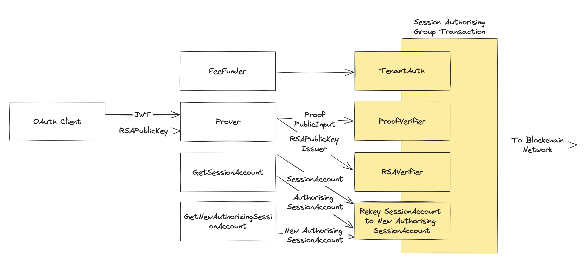
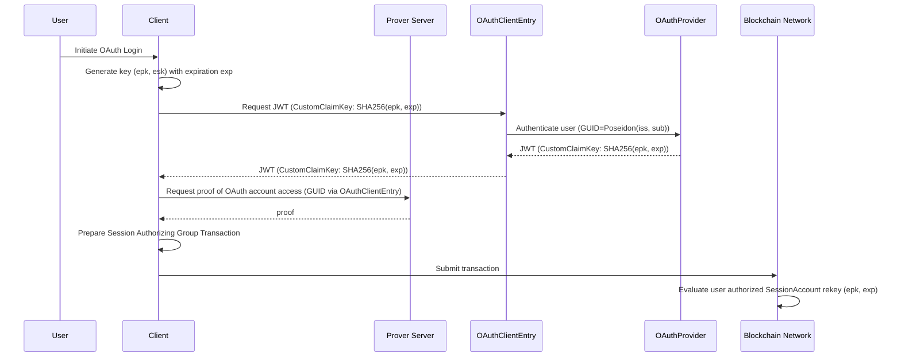

# Zorkin: OpenIDConnect for accessing a Self-Custodial Blockchain Account with ZK-SNARKs
<p align="center">
  
</p>

Zorkin covers a range of low-friction authentication methods to access self-custodial blockchain accounts, mostly leveraging ZK-SNARKs. This document covers using OpenIDConnect, and the [Magic Email](./MagicEmail.md) document covers how to leverage the DKIM protocol of email to create a ZK equivalent to the popular magic link authentication method to access a self-custodial wallet tied to a users email. **All rights reserved, with copyright, the works of Zorkin make several novel contributions with the Intellectual Property owned by Zorkin and its affiliates (Winton Nathan-Roberts).** There is an intent to turn Zorkin into a business.

## MVP Video

Video of an MVP implementation of the solution:

<a href="https://www.youtube.com/watch?v=37Q9ut-mHUE">
    
</a>

## Introduction

This document outlines a method for users to create application-specific wallets for holding assets related to that application (e.g. a game wallet), accessible via [OpenIdConnect](https://openid.net/developers/how-connect-works/) (OIDC) authentication with OAuth providers such as Facebook, X, and Google. The system enables users to maintain self-custody of their assets while ensuring privacy of their OAuth accounts. Key differentiators from existing solutions ([ZK-Login](https://sui.io/zklogin), [snark-jwt-verify](https://github.com/TheFrozenFire/snark-jwt-verify), [zkOauth](https://github.com/0xrishabh/zkOauth)) include eliminating the need for a dedicated [salting service](https://www.thesslstore.com/blog/difference-encryption-hashing-salting), seamless OAuth client migration, deferring resource-intensive ZK-SNARK proof generation, allowing authorization session parameters to be defined in any [JSON Web Token](https://jwt.io) (JWT) claim for better compatibility with various OAuth providers, and the ability to remotely revoke authorized sessions for security purposes.

The core of this system is the use of [ZK-SNARKs](https://www.youtube.com/watch?v=gcKCW7CNu_M) to create a GROTH16 proving system, based on the [BN254 ECC curve](https://neuromancer.sk/std/bn/bn254/), to prove OAuth account access. Successful proof of access authorizes an ephemeral key to send transactions from the user's `SessionAccount` for a limited time. This is achieved by [rekeying](https://developer.algorand.org/docs/get-details/accounts/rekey/) the base `SessionAccount` to an authorizing `SessionAccount` with the ephemeral public key (`epk`) and expiration (`exp`) session parameters as template variable values. The authorization involves a group transaction encompassing OAuth account access verification, JWT signature validity check using Multi-Party Computation (e.g., [ChainLink](https://www.youtube.com/watch?v=gcKCW7CNu_M)), and ephemeral key usage to authenticate rekey transactions. This process is overseen by the `TenantAuth` application, specific to each tenant—defined here as an instance of Zorkin that authenticates users into applications, like organizational websites, with each tenant being isolated and managed separately by the respective user of Zorkin.

Utilizing ZK-SNARKs in this manner preserves the privacy of user JWTs, anonymizing critical account identifiers like the subject field with hashes.

The following sections provide a detailed description of this solution, including its components, the integration of these components into protocols and procedures, a brief security analysis, and potential areas for future development. We focus on [Algorand](https://developer.algorand.org), however the same approach can be used for any blockchain with comprehensive smart contract support.

## Method

### Components of the Solution

#### JWTCircuit

The `JWTCircuit` is a ZK-SNARK circuit that takes a JWT, an RSA public key (`RSAPublicKey`), and a custom claim key as private inputs, and asserts that the public input is the [MIMC](https://eprint.iacr.org/2016/492.pdf) hash of `OAuthAccountGUID`, `CustomClaimValue`, `RSAPublicKey`, `OAuthClientEntry`, and `IssuerHash`. `OAuthAccountGUID` is the [Poseidon](https://eprint.iacr.org/2019/458.pdf) hash of the issuer and subject fields of the JWT, representing an anonymising unique identifier of the user within the providers platform. `RSAPublicKey` is the RSA public key (specifically RS-256 with exponent of 65537) of the issuer that signed the JWT. `OAuthClientEntry` is an anonymising identifier of the OAuth client and the JWT payload key of the value intended to carry the session parameters (`CustomClaimKey`) in the referenced value (`CustomClaimValue`), taken as the Poseidon hash of the issuer & audience claims of the JWT, and the `CustomClaimKey`. `IssuerHash` is a Poseidon hash of the issuer claim. The pseudocode of the circuit is as follows:

```java
JWTCircuit(private jwt, private RSAPublicKey, private CustomClaimKey, public publicInput):
  // Assert the JWT is authentic
  assert RSAVerify(jwt, RSAPublicKey)
  // Create anonymizing identifiers of the OAuth account and OAuth client, & the CustomClaimKey
  OAuthAccountGUID = Poseidon(jwt.iss, jwt.sub)
  CustomClaimValue = jwt[CustomClaimKey]
  OAuthClientEntry = Poseidon(jwt.iss, jwt.aud, CustomClaimKey)
  IssuerHash = Poseidon(jwt.iss)
  // Assert the public input is a hash of OAuthAccountGUID, CustomClaimValue, RSAPublicKey, OAuthClientEntry, & IssuerHash
  PublicInput = MIMC7(OAuthAccountGUID, CustomClaimValue, RSAPublicKey, OAuthClientEntry, IssuerHash)
  assert PublicInput == publicInput
```

When compiled, the circuit forms a GROTH16 proving system defined on the BN254 ECC curve consisting of a `prover`, and a verifier of proofs called the `ProofVerifier`. The `ProofVerifier` is described in terms of the verification parameters `JWTVKey`. The purpose of the proving system is to have a way of proving that a user has access to the tenants application through OpenIDConnect represented by the combination of the `OAuthClientEntry` and `OAuthAccountGUID` values, while keeping the JWT and its identifying claims private.

#### ProofVerifier

The `ProofVerifier` is a [Logic Signature](https://developer.algorand.org/docs/get-details/dapps/smart-contracts/smartsigs/modes/#contract-account) that is a verifier of proofs generated by the `prover`, described in terms of Verification parameters `JWTVKey`. It asserts that the `proof` given in the argument is valid against the public input (`publicInput`) provided in the transactions note. The note is used for the public input so it can be referenced by other transactions in the same [transaction group](https://developer.algorand.org/docs/get-details/atomic_transfers/#group-transactions).

The pseudocode of the verification logic:
```python
VKey = JWTVKey
def ProofVerifier(proof):
    # Assert fees are covered by an external account
    assert Txn.fee() == 0
    publicInput = Txn.note()
    assert ProofIsValid(proof, publicInput, VKey)
```

#### RSAVerifier

The `RSAVerifier` is an applicaton that maintains a cache of valid RSA public keys for each supported issuer in [Box Storage](https://developer.algorand.org/articles/smart-contract-storage-boxes/), as updated through decentralized HTTPs requests to the [JWK endpoints](https://mojoauth.com/glossary/oidc-json-web-key-endpoint/) of supported issuers. It exposes `ValidateOAuthRSAPublicKey`, a function through which a transaction can validate that a given RSA public key for an issuer is authentic.

```python
BoxStorage RSAPublicKeysByIssuerHash
string MPCHTTPSClientAddress
string MPCHTTPSClientChain

def ValidateOAuthRSAPublicKey(RSAPublicKey, issuerHash):
  assert RSAPublicKeysByIssuer[issuerHash].has(RSAPublicKey)

def UpdateOAuthJWKSCache(VAAMessage):
  # Assert message is untampered via MITM attack during transit
  assert Wormhole.Core.MessageIsValid(VAAMessage)
  assert VAAMessage.sender == MPCHTTPSClientAddress
  assert VAAMessage.source_chain == MPCHTTPSClientChain
  # Update valid JWK cache for the issuer
  keys = VAAMessage.keys
  issuerHash = VAAMessage.issuerHash
  RSAPublicKeysByIssuer[issuerHash] = keys
```

#### TenantAuth

`TenantAuth` is an application that is used to orchestrate proof verification to authorize the rekeying of a users `SessionAccount` to a new authorizing `SessionAccount`, that has template variables for the ephemeral public key `epk` and its expiration `exp` expressesd in validity rounds. Once rekeyed, a time-bound session is effectively established where the user can send transactions from their `SessionAccount` by signing their transaction Id with the ephemeral private key `esk` and providing the signature as an argument to the authorizing `SessionAccount`, until transactions have a last validity that exceeds the `exp` template variable value. `TenantAuth` maintains a list of `OAuthClientEntry` it considers valid, through which users can authorize `SessionAccount` rekeying. The application hardcodes the address of the `ProofVerifier`, `ProofVerifierAddr`, and the application Id `RSAVerifierAppId` of the `RSAVerifier` through which it can assert the presence of these components in the authorizing group transaction to ensure proof validity and JWT signature authenticity.

It can be called through `FeeFunder`, which is a Logic Signature that anyone can use to call the `ApproveSession` function of the `TenantAuth` application identified by the template variable `TMPL_TENANTAUTHAPPID` of its application Id. It will cover the transaction fees involved in authorizing a new `SessionAccount` via fee-pooling.

##### TenantAuth Application

```python
BoxStorage OAuthClientEntrys
string ProofVerifierAddr # Hardcoded Address of the verifier LSIG
string RSAVerifierAppId # Hardcoded App ID of the RSA Verifier

def AddNewOAuthClientDescriptor(OAuthClientEntry):
  assert Txn.sender == AppParam.creator()
  OAuthClientEntrys.add(OAuthClientEntry)

def ApproveSession():
  assert Txn.group_size == 4
  # Extract Pre-Image of the Public Input and Session parameters (epk, exp) from the self-payment to the SessionAccount
  sessionAccountTxn = Gtxn[3]
  Epk, Exp, RSAPublicKey, OAuthAccountGUID, OAuthClientEntry, issuerHash = sessionAccountTxn.note()

  # Assert proof with publicInput is valid against the ProofVerifier
  CustomClaimValue = Sha256(Epk, Exp)
  PublicInput = MIMCHash(OAuthAccountGUID, CustomClaimValue, RSAPublicKey, OAuthClientEntry, issuerHash)

  proofVerifierTxn = Gtxn[1]
  assert proofVerifierTxn.sender == ProofVerifierAddr
  assert proofVerifierTxn.note() == PublicInput
  assert OAuthClientEntrys.has(OAuthClientEntry)

  # Assert the JWT signature is authentic for the issuer
  RSAVerifierTxn = Gtxn[2]
  assert RSAVerifierTxn.appId == RSAVerifierAppId
  assert RSAVerifierTxn.application_args[0] == "ValidateOAuthRSAPublicKey"
  assert RSAVerifierTxn.application_args[1] == RSAPublicKey
  assert RSAVerifierTxn.application_args[2] == issuerHash

def RevokeSession():
  assert Txn.sender == AppParam.creator()
  assert Txn.group_size == 2
  assert Gtxn[1].type == "rekey"
  assert Gtxn[1].rekeyTo == Gtxn[1].sender
```

##### FeeFunder LSIG

```python
TenantAuthAppId = TMPL('TMPL_TENANTAUTHAPPID')

def FeeFunder():
  assert Txn.appId == TenantAuthAppId
  assert Txn.application_args[0] == "ApproveSession"
  assert Txn.fee() == 4 * Global.MinTxnFee
```


#### SessionAccount

The `SessionAccount` is a Logic Signature contract account that holds a users assets, and has template variables to simulate authorized sessions where a user can freely transact using just the ephemeral key until expiration, once the user has authorized through proof of access to the corresponding OIDC application identified by the combination of the user `OAuthAccountGUID` and the OAuth client `OAuthClientEntry`. The account is directly mapped and unique to a users OAuth account identifier `OAuthAccountGUID`, and the tenants `TenantAuth` application which represents the application the user is authenticating into via OpenIDConnect. There are two main cases it handles: (1) the user has provided a signature of the transaction Id using the ephemeral key with a last validity that's before the expiration as specified by the template variables `EpkTemplate` and `ExpTemplate` respectively, or (2) the user is proving they have access to the account `OAuthAccountGUID` and they're authorizing through an OAuth client with a `CustomClaim` as identified by `OAuthClientEntry`, where an ephemeral key signature of the transaction is provided to prevent [replay attacks](https://www.kaspersky.com/resource-center/definitions/replay-attack). Replay attacks are prevented under the assumption no one but the user has the private key, and the transaction Id is unique particularly when the [lease](https://developer.algorand.org/articles/leased-transactions-securing-advanced-smart-contract-design/) field is set to a random value.

```python
DefaultEphemeralKey = Bytes(16, "CAFEFACE")
ExpTemplate = TMPL('TMPL_EXP')
EpkTemplate = TMPL('TMPL_EPK')
OAuthAccountGUIDTemplate = TMPL('TMPL_OAUTHACCOUNTGUID')
TenantAuthAppId = TMPL('TMPL_TENANTAUTHAPPID')

def tenantIsRevokingSession():
    # Assert it's the tenant revoking any active session
    assert Txn.groupSize == 2
    assert Gtxn[0].type == "appl"
    assert Gtxn[0].appId == TenantAuthAppId
    assert Gtxn[0].appArgs[0] == "RevokeSession"

    assert Txn.type == "rekey"
    assert Txn.rekeyTo == Txn.sender
    # Assert external account (i.e. Tenant) is covering the transaction fee
    assert Txn.fee() == 0

def hasOAuthAccountAccess(sig):
    # Assert external account (i.e. FeeFunder) is covering the transaction fee
    assert Txn.fee() == 0
    # Ensure the publicInput pre-image is linked to this particular account
    [OAuthAccountGUID] = Txn.note()
    assert OAuthAccountGUID == OAuthAccountGUIDTemplate
    # Assert we're in a group that includes an application call to "ApproveSession" of the TenantAuth application
    # TenantAuth will orchestrate the components involved in authorization such as proof verification
    assert Gtxn[0].type == "appl"
    assert Gtxn[0].appId == TenantAuthAppId
    assert Gtxn[0].appArgs[0] == "ApproveSession"

# Entry point
def SessionAccount(sig):
    # Case: Tenant is revoking an active session
    if (
        Gtxn[0].appId == TenantAuthAppId and
        Gtxn[0].appArgs[0] == "RevokeSession"
       ):
      assert tenantIsRevokingSession()

    # Case: Base Account and Authorizing Account are the same (e.g. on creation)
    elif EpkTemplate == DefaultEphemeralKey:
        assert hasOAuthAccountAccess(sig) 

    # Case: Approving a transaction within a session
    elif (
          ED25519_Verify(sig, Txn.transaction_id, EpkTemplate) and 
          ExpTemplate < Txn.lastValid
         ):
        Approve()

    # Case: Rekeying to a new SessionAccount to authorize a new session.
    else:
        assert hasOAuthAccountAccess(sig)
```

#### SessionAccount Reproduction

We can reproduce the LSIG for a SessionAccount and its authorizing SessionAccount using only a known `TenantAuthAppId` and `OAuthAccountGUID`. The base `SessionAccount` is reproducible by assigning default values to the session parameters, the ephemeral public key and its expiration, and the known `TenantAuthAppId` and `OAuthAccountGUID` values for the respective template variables in the known `SessionAccount` program code. To reproduce the authorizing `SessionAccount` LSIG, a custom [Conduit](https://developer.algorand.org/docs/get-details/conduit/) Indexer (CustomIndexer) is used to identify the previous Session authorizing rekey transaction by querying the most recent transaction with a `rekeyTo` field that matches the current authorizing address. Once identified, the current session parameters can be read from the transaction and used to reproduce the authorizing `SessionAccount` LSIG. 

```python
defaultEphemeralKey = Bytes(16, "CAFEFACE")

def GetBaseAccount(
    OAuthAccountGUID,
    TenantAuthAppId
  ):
  return SessionAccount({
    TMPL_OAUTHACCOUNTGUID: OAuthAccountGUID,
    TMPL_EPK: defaultEphemeralKey, TMPL_EXP: 0,
    TMPL_TENANTAUTHAPPID: TenantAuthAppId
    })

def GetAuthorizingAccount(
    OAuthAccountGUID,
    TenantAuthAppId
  ):
  # Get the last transaction from the authorizing address
  baseAccount = GetBaseAccount(OAuthAccountGUID, TenantAuthAppId)
  authorizingAddress = baseAccount['auth-addr']
  lastAuthTxn = CustomIndexer.GetLastTxnWithRekeyTo(authorizingAddress)
  if lastAuthTxn == None:
    return GetBaseAccount(OAuthAccountGUID, TenantAuthAppId)
  # Get the template variables from the last transaction
  epk, exp, tenantAuthAppId = ReadTemplateVariables(lastAuthTxn)
  return SessionAccount({
    TMPL_OAUTHACCOUNTGUID: OAuthAccountGUID,
    TMPL_EPK: epk, TMPL_EXP: exp,
    TMPL_TENANTAUTHAPPID: tenantAuthAppId
    })

def GetSessionAccount(
    OAuthAccountGUID,
    TenantAuthAppId
  ):
  return [
          GetBaseAccount(OAuthAccountGUID, TenantAuthAppId),
          GetAuthorizingAccount(OAuthAccountGUID, TenantAuthAppId),
        ]

def GetNewAuthorizingSessionAccount(
      OAuthAccountGUID,
      TenantAuthAppId,
      epk,
      exp
    ):
    return SessionAccount({
      TMPL_OAUTHACCOUNTGUID: OAuthAccountGUID,
      TMPL_EPK: epk, TMPL_EXP: exp,
      TMPL_TENANTAUTHAPPID: tenantAuthAppId
      })
```

### Protocols & Procedures

#### Account Creation

There is nothing unique about account creation, except for the sending of a recovery email which a user can use to prove account ownership using ZK-Email for recovery purposes. The recovery process is to be refined in a future version of Zorkin, and is left as future work.

#### Authorize a new Session

To authorize a new session, the user identified by `OAuthAccountGUID` must first login with OIDC on the interfacing application through the OAuth client with custom claim key identified by `OAuthClientEntry` to create an authorized session of access to their `SessionAccount` that's specific to the combination of `OAuthAccountGUID` and the Id of the `TenantAuth` application. The session of access is represented by the ephemeral public key `epk` and expiration of access `exp`, with the session being represented by an instance of their `SessionAccount` that has these parameters as template variable values. A group transaction will be constructed from the OIDC JWT response to prove that the user identified by `OAuthAccountGUID` on the issuers platform has authorized the rekeying of their corresponding SessionAccount to a SessionAccount that specifies the ephemeral key `epk` and its expiration `exp` as template variables, where future transactions from the account will be approved if a signature of their Id is provided as an argument using the ephemeral private key (`esk`) until they have a last validity that exceeds `exp`. The details of the procedure are as follows:

1. The user initiates the authorization by signing into the application through their chosen OAuth provider.
2. An ephemeral ED25519 key is randomly generated with public key `epk` and private key `esk`, along with an expiration expressed in terms of validity rounds for when the key is to expire (`exp`). 
3. The Sha256(`epk`, `exp`) hash is inserted into the request, so it will appear in the returned JWT payload as the value `CustomClaimValue` with key `CustomClaimKey`. The OAuth request is then submitted through the OAuth client.
4. The JWT (`jwt`) is returned by the request. The private and public inputs for the `prover` are generated from the JWT. The private inputs are the `jwt`, `RSAPublicKey`, and `CustomClaimKey`, where `RSAPublicKey` is the public key of the RSA key that the OAuth provider used to sign the JWT with. The public input is taken as the MIMC7 hash, `MIMC7(OAuthAccountGUID, CustomClaimValue, RSAPublicKey, OAuthClientEntry, IssuerHash)`, where `OAuthClientEntry` is an identifier of the client for the issuer taken as the Poseidon hash `Poseidon(jwt.iss, jwt.aud, CustomClaimKey)`. The `jwt.iss` and `jwt.aud` values are the issuer and audience claims of the JWT, identifying the issuer and the OAuth client respectively. `IssuerHash` is taken as `Poseidon(jwt.iss)`, making it an identifier of the issuer.
5. The public input and private inputs are sent to the `prover-server`, for `proof` generation by the `prover`.
6. The users `SessionAccount` is reproduced, which is the self-custodial wallet containing their assets. The base (`baseSessionAccount`) and authorizing (`authorizingSessionAccount`) LSIG contract accounts are reproduced by calling the `GetSessionAccount(OAuthAccountGUID, TenantAuthAppId)`. `TenantAuthAppId` is the application Id of the `TenantAuth` application that is representing the application that the user is accessing.
7. The new authorizing account, `newAuthorizingSessionAccount`, to which the users base `SessionAccount` will be rekeyed is generated by calling `GetNewAuthorizingSessionAccount(OAuthAccountGUID, TenantAuthAppId, epk, exp)`. It is the same SessionAccount, however using the new ephemeral key and expiration as template variables, representing their newly authorized session.
8. Taking the data gathered so far, the following group transaction (`AuthorizeSession`) compromising of four component transactions is constructed:
    - **TenantAuth**: An application call to the `ApproveSession` function of the tenants `TenantAuth` application with application Id `TenantAuthAppId`. The transaction is from the `FeeFunder` LSIG which will cover the transaction fees of the group, where `TMPL_TENANTAUTHAPPID` is assigned `TenantAuthAppId`.
    - **ProofVerifier**: A self-payment of 0 to the `ProofVerifier` LSIG, where the `proof` is provided as the argument and the public input is specified as the note.
    - **RSAVerifier**: An application call to the `ValidateOAuthRSAPublicKey` function of the `RSAVerifier` application, with application arguments `RSAPublicKey` and `IssuerHash`.
    - **SessionAccount**: A self-payment of 0 to `baseSessionAccount`, with a rekey to `newAuthorizingSession` specified in the rekeyTo field. The transaction is signed with `authorizingSessionAccount`, with a signature made with `esk` of the transactions Id given as an argument. The pre-image to the public input, `epk` and `exp` are put into the note field. To ensure the transaction is mutually exclusive during its validity window, a random lease value is added.
9. The authorizing group transaction is now submitted to the blockchain network for evaluation.

By the atomic nature of the transaction, authorization is broken into distinct components that are orchestrated by `TenantAuth` which oversees that the proof is valid, that `OAuthClientEntry` is a supported OAuth client, and that the RSA public key is authentic to the issuer. The current authorizing SessionAccount will check that the transaction Id has been signed with the ephemeral private key `esk`, to prevent malicious authorization through replay of the inputs. This is because we can assume no one else has the private key, and that the transaction Id is unique.



##### Sequence Diagram of the SessionAccount authorization

The following is a sequence diagram of SessionAccount authorization, which has been greatly simplified for a high-level overview of the protocol. Please refer to the above for specific details.



#### Transacting within an Authorized Session

Once a session has been authorized, the user is able to perform transactions from the SessionAccount. For a transaction to be considered valid, its Id must be signed with the ephemeral private key `esk` associated with the authorizing SessionAccount. This signature is included as an input argument to the authorizing `SessionAccount`'s Logic Signature (LSIG), which then serves as the signing authority for the transaction. The completed transaction, signed by the authorizing SessionAccount LSIG, can then be submitted to the blockchain network.

Procedure:
0. Calculate the `OAuthAccountGUID` by applying the Poseidon hash to the OAuth2 provider's issuer identifier (`jwt.iss`) and the user identifier (`jwt.sub`).
1. Compute the `OAuthClientEntry` by hashing the issuer identifier (`jwt.iss`), the OAuth2 client identifier (`jwt.aud`), and `CustomClaimKey` using the Poseidon hash.
2. Reproduce the base SessionAccount and its authorizing SessionAccount using the known `OAuthAccountGUID` and `OAuthClientEntry` by calling the `GetSessionAccount` function with these values as arguments. 
3. Create the desired transaction from the base SessionAccount, specified in the sender field of the transaction.
4. Assign a random value to the lease field to ensure the transaction ID is unique, and mutually exclusive until the lease expires.
5. Sign the tranasction Id with the ephemeral private key `esk` of the authorizing SessionAccount, and add the signature as an argument to the authorizing SessionAccount LSIG.
6. Sign the transaction with the authorizing `SessionAccount` Logic Signature.
7. Submit the transaction to the network.

#### Revoking a Session

A tenant can revoke a session on behalf of one of their users. To do so, they must construct a group transaction that includes a rekey of the SessionAccount to its base account, along with an application call to the `RevokeSession` function of `TenantAuth` with the tenants application Id `TenantAuthAppId`. The inclusion of `RevokeSession` will allow the approval. In steps:

1. Compute `OAuthAccountGUID` as `Poseidon(jwt.iss, jwt.sub)`
2. Compute `OAuthClientEntry` as `Poseidon(jwt.iss, jwt.aud, CustomClaimKey)`
3. The users base `SessionAccount` (`baseSessionAccount`) and authorizing account (`authorizingSessionAccount`) are retrieved with `GetSessionAccount(OAuthAccountGUID, TenantAuthAppId)`. `TenantAuthAppId` is the application Id of the tenants `TenantAuth` application.
4. The following group transaction is created:
      - **TenantAuth**: Application call to the `RevokeSession` function of the `TenantAuth` application, with application Id `TenantAuthAppId`.
      - **SessionAccount**: self-payment of 0 from `baseSessionAccount` LSIG, rekeying the account to `baseSessionAccount` by assigning the `rekeyTo` field as `baseSessionAccount`. The transaction is signed with the authorizing account, `authorizingSessionAccount`.
5. The transaction is submitted to the network.

The user still retains custody of their assets, however must sign-in again via OpenIdConnect. The tenant may do so as a precautionary measure, or to defend against a malicious adversary that has compromised accounts.


#### Account Recovery

To simplify, account recovery in Zorkin, not previously mentioned, involves adding a recovery factor to the `SessionAccount` logic signature for access restoration. A proposed recovery method is using [ZK-Email](https://prove.email/) to send a recovery email at account creation. The user then verifies access to this email, linked to the `SessionAccount` through elements like the [DKIM](https://www.cloudflare.com/en-au/learning/dns/dns-records/dns-dkim-record/) email signature RSA public key and a hash of their email address as template variables.

#### Proof Generation Deferral

Proof generation by a remote prover, which can be resource-intensive, is postponed until required for signing to optimize costs and loading times. This enhances user experience, as many dApp users, like those browsing an NFT marketplace, don't necessarily transact. Once generated, a proof needs only a single verification for session establishment (i.e., rekeying), allowing subsequent spending without further proof generation or verification until expiration, thereby reducing authentication fees and prover server costs.

## Differentiation & Improvements to Existing Work

Zorkin advances the state of similar authentication technology in several ways when compared to existing solutions such as Sui's [ZK-Login](https://sui.io/zklogin) and [snark-jwt-verify](https://github.com/TheFrozenFire/snark-jwt-verify). Here are the key improvements made by Zorkin more clearly explained:

1. **Elimination of Salting Service Dependency**: Zorkin removes the dependency on a salting service. Salting services add a layer of complexity and poses a potential vulnerability; if the salting service is compromised, it could lead to the loss of access to accounts. Furthermore, relying solely on a salting service does not mitigate the risk associated with an OAuth2 provider directly accessing accounts, as they have the authority to issue valid JWTs by design.

2. **Reduced Proof Verifications**: Another significant enhancement Zorkin offers is minimizing the frequency of proof verifications required for transaction authorization. By creating a trusted session that lasts for several hours, users do not need to generate new proofs or their verification for every transaction during that session. This reduction in verification needs leads to lower transaction fees and a smoother user experience.

3. **Deferred Proof Generation**: In line with providing a better user experience, Zorkin defers the generation of ZK-SNARK proofs until the point they are actually needed, which is when authorizing a new `SessionAccount` to establish an authorized session. This approach relieves the server from the computational demands of generating proofs for every user upon log-in, especially beneficial when many users may not engage in transactions immediately. By deferring this intensive process, Zorkin ensures faster application loading times and optimizes resource utilization.

4. **Enhanced Flexibility with Authentication Providers**: Existing solutions often depend on the ability to define a 'nonce' claim during the OAuth2 request to set up the ephemeral key. This presents a limitation because not all authentication solutions—like [Firebase](https://firebase.google.com/docs/auth)—allow programmatic control over the nonce claim for specification of the ephemeral payload. Zorkin's implementation uses a `CustomClaim`, representing any user definable claim, which is a more flexible approach that is not restricted to a specific claim like 'nonce'. Hence, Zorkin's design allows it to work with a broader range of authentication providers (like Firebase) that may not allow customization of the nonce claim.

5. **Revocation of Active Sessions**: Zorkin allows users to revoke any active session by rekeying the SessionAccount back to the base SessionAccount, either using the ephemeral key itself, or remotely making use of the tenants `TenantAuth` application which allows only the tenant to revoke the session. This is useful in the event of SessionAccount loss of access for any reason, such as a malicious takeover or simply as a safety measure to prevent long range attacks that might utilise an old unexpired ephemeral key.

6. **OAuth Client Abstraction**: Zorkin employs the tenant concept to abstract the way users authenticate with OpenIdConnect. This approach ensures that a SessionAccount is not bound exclusively to a specific OAuth client, as determined by the audience claim in a JWT. Instead, a `SessionAccount`'s identity hinges on two key elements: the `TenantAuth` application of a tenant, and the user's unique identifier, `OAuthAccountGUID`, in the issuer's database. This identifier is solely reliant on the subject and issuer claims of the JWT. Importantly, this enhanced method does not entail any security compromises. The benefit of this abstraction is it allows effortless migration to a new OAuth client, without concern for users losing access to their accounts.

These improvements focus on enhancing security, reducing costs, and offering a more adaptable and user-friendly authentication mechanism suitable for a variety of applications and authentication services.

## Improvements

For simplicity and clarity of explanation, certain mechanisms were excluded. These represent small improvements in security and privacy preservation, and are explained below.

### Restricting Rekey to Session Accounts owned by the user

In the above, during authorization and use of a SessionAccount, there is no limitation on the account that a user can rekey to. An improvement is to restrict the account to only other instances of the SessionAccount with the same `OAuthAccountGUID` and `TenantAppAuthId`, that way the user can always authenticate with OpenIdConnect to gain access. An exception is when the user is recovering their account with a recovery factor such as ZK-Email, or if another function is added to allow the upgrade of a SessionAccount for versioning.

On-Chain this can be implemented by keeping the compiled TEAL of a SessionAccount in a variable, with uniquely identifiable defaults for the template variables such as `CAFEFACE` in hexadecimal. These defaults can then be simply found and replaced with the value for the ephemeral key and expiration during an authorization attempt. The hash of the program code is then the address (see [SmartSignatures](https://developer.algorand.org/docs/get-details/dapps/smart-contracts/smartsigs/modes/)) which we can compare to the rekeyTo field of the rekey transaction. 

### Improving Privacy with Hashing

Currently the `OAuthClientEntry` and `OAuthAccountGUID` fields are the Poseidon hashes of `Poseidon(jwt.iss, jwt.aud, CustomClaimKey)` and `Poseidon(jwt.iss, jwt.sub)` respectively. This makes them identifiable to an OAuth provider to see their users participation in Zorkin. To mitigate this, we can introduce a salting factor taken as the `TenantAuth` application Id or a known master salt secret maintained by a tenant, which can even be stored client-side. The application Id is preferred here, as it's simple, can't be lost and offers a similar level of privacy-preservation. This is not the same as maintaining a salting service, which is much more complex.

### Utilization of on-chain verification to reduce Proof Generation compute

RSA verification could in theory be offloaded to the blockchain, instead of doing it inside of a ZK-SNARK circuit which currently contributes nearly half of the constraints. ZK-SNARK circuits are expressed in terms of quadratic constraints of the form `A*B+C==0`, and are proportional to the time it takes to generate a proof with the proving system and the space a prover occupies. There is the possibility Algorand could introduce an RSA opcode, although this should not be relied on.

### Indexer-free alternative

Instead of reproducing a SessionAccount and its authorizing SessionAccount using an indexer as explained, an alternative is to simply store the session parameters `epk` and `exp` in the box storage of the `TenantAuth` application to which the account is associated, every time a user authorizes a new SessionAccount when proving corresponding OAuth account access. This isn't necessarily better, as it has minimum-balance requirement cost associated with box storage which is redeemable on clearing of the box storage. An Indexer is assumed to be an indexer of all blockchain state, and allowing for fairly efficient queries of the B-Tree SQL stored data.

## Security Proof

The following gives a sketch proof as to why the solution is secure, under the given assumptions. Please refer to the above text for definitions of any unfamiliar terms like `OAuthAccountGUID`.

### Assumptions

- The Wormhole bridge that relays the JSON Web Keys from the Multi-Party Computation (MPC) solution is secure.
- The application client (e.g. website) that interfaces with the solution is not malicious. This can be proven through use of DNS integrity checks, for example by using the [DNSSEC](https://www.icann.org/resources/pages/dnssec-what-is-it-why-important-2019-03-05-en) and [DNSLINK](https://www.dnslink.io/) protocols.
- The OAuth provider that is providing authentication through OpenIDConnect is not malicious.
- The entropy used for ephemeral key generation is random and very high, so that a unique ephemeral key is created every time. Meaning the private ephemeral key should be known only to the user.

### Proving Safety

#### Only the OAuth user can access their account with self-custody

```
Claim: No one except people with access to the OAuth account identified by OAuthAccountGUID can access SessionAccounts that are linked to the same Id.
```

The only way to create an ephemeral key is through proving access to the OAuth account identified by `OAuthAccountGUID`, where the sender can specify the ephemeral key. The smart contract design requires proof of account access, which requires proving access with a valid JWT, with the ephemeral public key proven to be included in a customizable claim (`CustomClaim`). The JWT signature authenticity is checked against the cache of valid JWKs as recorded at the respective issuers JWK endpoint with `RSAVerifier`, proving authencity. The proof payload and inputs cannot be replayed to engage in a replay attack, because `SessionAccount` requires the rekey transaction Id be signed with the ephemeral private key. Therefore no one but the user with access to the OAuth account can access the `SessionAccount` which is tied to `OAuthAccountGUID`.

## Future Work

The following details future work that we intend to engage in for the continued development of Zorkin.

1. Refine the Zero-Knowledge Email (ZK-Email) recovery process.
2. Introduce the refinements explained in the above improvements section.
3. Research & Develop means of reducing friction in [Opt-In](https://developer.algorand.org/docs/get-details/asa/) & fee management with `SessionAccount` compatibility.

## Contribution Statement

Authored by Winton Nathan-Roberts of Sydney, Australia, this document details original work distinct from existing literature to the best of my knowledge. Novel contributions include its approach in implementing OAuth2 self-custodial access by recursively regenerating and rekeying SessionAccount LSIGs, the elimination of a salting service, proof generation deferral, decentralized recovery options, reduction in gas fees associated with constant proof verification, revocation of active sessions and the independence of a users SessionAccount from a particular OAuth client through the concept of a tenant. Thanks to the Algorand community for their support.
\
\
All Rights Reserved with Copyright.

## Disclaimer

This content, including texts, graphics, code, etc., is for informational purposes and provided 'as is' without guarantees.

- NO WARRANTIES: We offer no warranties or guarantees, explicit or implied.
- NO LIABILITY: We are not liable for any damages from using or inability to use this content.
- OWNERSHIP OF IMPROVEMENTS: Any feedback or ideas from the public contributing to the enhancement of this solution are exclusively owned by the author and Zorkin, assuming such ownership is legally permissible.
- NON-PATENTABILITY: The content, by virtue of being publicly available online, is not novel. Therefore any novel contributions made by the document and its trivial extensions cannot be patented, except where legal. Patent laws require novelty and non-obviousness. An exception is the author of the work has a 1-year grace period in many countries from the time of their publication to file a patent at their discretion.
- INDEPENDENCE: We do not necessarily have a direct affiliation with any party mentioned or implied besides Zorkin.
- INDEMNIFICATION: You must defend and indemnify us against all claims and damages from your use of the content.
- NOT PRODUCTION READY: The content may have vulnerabilities and is not for production use.
- USE AT YOUR OWN RISK: You are solely responsible for using the content and ensuring its legal compliance.
- UNVERIFIED CLAIMS: Claims in the content are not independently verified; do your own research before relying on them.

This disclaimer is applied to the fullest extent permitted by law. By using the content, you accept these terms. Note: I am not a legal professional. TLDR: it's an idea and an MVP, that I may or may not continue to work on at my discretion. Everything is subject to change, including the name.
